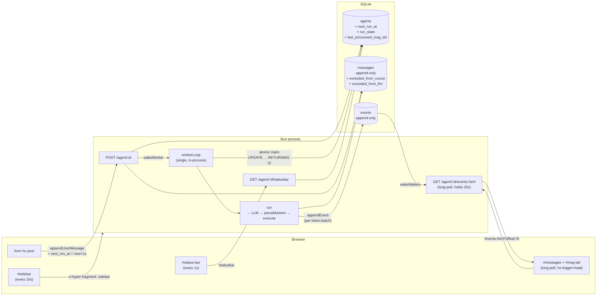

# hyper-code2

[](https://github.com/niquola/hyper-code2/actions/workflows/test.yml)

A self-extending AI agent server on Bun. Procedural TypeScript, ~1000 LOC, **markers protocol** instead of native tool-calls.

The agent acts by emitting `///eval` / `///write:<path>` / `///bash` / `///html` markers in plain content. The runtime parses each marker, executes its body (JS/TS for eval, file write for write, `bash -c` for bash, TSX render for html), and feeds the result back as a synthetic user message on the next turn. No JSON tool schemas, no escape-in-escape, one wire format.

**State is separated from functions.** Behaviour lives in files under `src/` / `.hyper/` and is loaded into `ctx.fns.<module>.<fn>`; runtime state lives on `ctx.state` (in-memory) and a SQLite DB (`agents`, `messages`, `events`, any table the agent chooses to add). Replacing a file + `ctx.fns.repl.load(ctx, "<module>")` swaps the function everywhere without touching state or restarting the process — routes, procedures, types, even the agent loop itself can be extended live.

**All sessions are in SQLite and fully agent-accessible.** Every turn's messages and UI events for every agent are rows in `.hyper/_runtime/sessions`. The agent reads its own + other agents' history with a one-liner: `///eval\nctx.fns.db.select(ctx, "SELECT … FROM messages …")`. Useful for recalling prior work, mining patterns, or building custom indexes.

## What it is

A tiny HTTP server that hosts a multi-agent chat. Each agent has four markers it can emit:

| marker            | body                | result fed back                    | used for                                  |
| ----------------- | ------------------- | ---------------------------------- | ----------------------------------------- |
| `///eval`         | JS/TS              | captured `console.log` output      | **main action** — compute, call ctx.fns, query DB |
| `///write:<path>` | file contents       | "wrote N bytes"                    | dropping multi-line file content verbatim |
| `///bash`         | shell script        | stdout (or `[exit N]` + stderr)    | quick lookups: `ls`, `git`, `grep`, `head` |
| `///html`         | TSX fragment        | nothing (final answer)             | rich UI bubbles with Tailwind, interactive forms |

Through `///eval` the agent can:

- Compute anything via the Bun runtime — `Bun.file`, `Bun.write`, `Bun.$` shell, `bun:sqlite`, `Bun.sql`, `Bun.redis`, `Bun.s3`, `fetch`, `crypto`.
- **Read its own source** (`Bun.file("src/agent/run.ts").text()`).
- **Write new procedures** to `src/<module>/<fn>.ts` or `.hyper/<module>/<fn>.ts` and hot-reload them — no restart.
- Add new HTTP routes on the fly (`$route_*.ts` → dynamic dispatch).
- Mutate its own model, system prompt, scratchpad between turns.
- Compact its own history (`ctx.fns.agent.compact(ctx, agent, …)`) when results grow too large.

Through `///html` the agent answers with **TSX**: full JS interpolation in `{expr}`, auto-escape, Tailwind classes inline, even `<form method="POST">` that sends the user's input straight back into the conversation. No template engine — JSX is the template engine.

## Architecture in one picture



**DB-first.** The DB is the source of truth for messages, events, and run state. Browser drives long-poll + status/sidebar polls — no JSON polling for chat, no SSE for data. Client JS is ~30 lines (Enter-key + scroll-on-swap). Full spec: [`docs/architecture.md`](docs/architecture.md).

**No queue table.** "When should this agent run next?" lives on `agents.next_run_at`; "is it running right now?" on `agents.run_state`. POST writes one message + bumps `next_run_at`; the worker atomically claims via `UPDATE agents … RETURNING id` and processes everything since `last_processed_msg_idx` in one pass. Synthetic `///result:*` user-messages emitted by `run()` itself are tagged `excluded_from_cursor=1` so they don't look like fresh input — only real user POSTs schedule the next run.

**Settings.** Declared key/value store in `src/<mod>/$setting_<key>.ts`. Resolution chain: explicit caller input → DB row → declared `env` binding → declared `default` → caller fallback. Shipping declarations: `llm.defaultModel`, `agent.debounceMs`, `agent.protocol`, `provider.{baseUrl,apiKey}` for each LLM backend, plus per-provider api-key declarations.

## Conventions (procedural, one thing per file)

- **`src/<mod>/<fn>.ts`** → `ctx.fns.<mod>.<fn>` when its default export is `async function (ctx, ...)`.
- **`src/<mod>/$type_<Name>.ts`** → `types.<mod>.<Name>` global type via `genTypes`. No `import type` of project types anywhere.
- **`src/<mod>/$setting_<key>.ts`** → declared setting (`{ type, default, env, options, … }`).
- **`src/<mod>/$route_<path>_<METHOD>.ts`** → HTTP handler. `_` = `/`, `$param` = `:param`.
- **`src/<mod>/$migrate_<ts>_<name>.up.sql`** + paired `.down.sql` → SQLite migration applied at startup.
- **`src/<mod>/$script_<name>.js`** → browser asset, served as `/<mod>/<name>.js`.

No cross-imports between project files — call other procedures via `ctx.fns`. `import` only from `bun`, `node:*`, npm. `.hyper/` mirrors `src/` and loads after it; gitignored, runtime-writable.

## Layout

```
src/
  $main.ts                        entry: loadFns → genTypes → db.connect → db.migrate → loadAll → loadRoutes → http.start → workerLoop
  $route_GET.ts                   GET /  — Tailwind chat UI
  $type_Context.ts                global Context type
  ctx_ns.d.ts                     AUTO-GEN — never edit

  agent/                          ctx.fns.agent.*
    SYSTEM_PROMPT_CORE.txt        invariants + map of ctx.fns + doc pointers (~5 KB)
    SYSTEM_PROMPT.txt             markers wire-format with full HTML/TSX examples (~10 KB)
    fullSystemPrompt.ts           composes CORE + WIRE + per-agent + runtime
    parseMarkers.ts               three regexes + lookbehind escape + permissive misplaced-marker detection
    formatMarkerResult.ts         renders ///result:eval / ///result:write:<path> / ///result:bash blocks
    formatMarkerError.ts          renders ///error:marker-misplaced warning blocks
    run.ts                        turn loop — stream → parse → execute markers → feed results
    workerLoop.ts / wakeWorker    single in-process drainer
    waitForEvent / wakeWaiters    per-agent long-poll wake mechanism
    compact.ts                    shrink the last result OR drop a tail with a synthetic note
    delegateTask.ts / finishTask  parent ↔ child orchestration
    llmCall.ts / readAndSummarize one-shot focused inference
    renderEventHtml / renderStatusBar
    $route_*.ts                   /agent/:id (POST/GET), /events.html (long-poll), /statusbar, /fork, /archive ...

  session/                        ctx.fns.session.*  ← DB-first persistence
    appendMessage / replaceMessages / truncateMessagesFrom / deleteMessageAt
    appendEvent + per-type helpers (assistant/user/thinking/toolCall/error)
    getMessages / getEvents / getMaxEventIdx / getFullMessages
    save / load / loadAll / list / search / archive / delete / fork / syncAgentState / updateScratchpad
    $migrate_*.up.sql             schema evolution (idx, archived_at, forks, settings, kv, excluded_from_llm,
                                  excluded_from_cursor, drop_tool_calls, …)

  settings/                       ctx.fns.settings.*  ← DB-backed key-value with declared schema
    get / set / remove / list / getNumber / getString
    declared / renderDeclaredForm / modelDefault
    $route_declared_GET.ts        UI form for tweaking settings live

  llm/                            ctx.fns.llm.*
    stream.ts                     dispatch by provider → streamOpenAI / streamAnthropic / streamCodex / streamMock
    streamAnthropic.ts            includes Claude Code subscription support (refreshClaudeCode + identity headers)
    refreshClaudeCode.ts          reads/refreshes the Claude Code OAuth token from macOS keychain
    refreshCodex.ts               same for the ChatGPT/Codex backend (~/.codex/auth.json)
    refreshKimiCode.ts            same for kimi-coding (~/.kimi/credentials/kimi-code.json)
    resolveEndpoint.ts            "<provider>:<modelId>" → {url, apiKey, api}
    listModels.ts                 curated + live discovery for the new-agent form
    $setting_*.ts                 per-provider apiKey / baseUrl declarations

  files/                          ctx.fns.files.* — sandboxed under cwd, UI reflects changes
  events/                         ctx.fns.events.* — server-side event bus
  ui/                             ctx.fns.ui.* — drives the browser (eval, action, notify, openAgent, openFile)
  markdown/                       ctx.fns.markdown.* — Bun.markdown.html + shiki
  repl/                           ctx.fns.repl.* — eval, hot-reload, POST /repl
  http/                           ctx.fns.http.* — Bun.serve + dynamic route dispatch
  git/                            ctx.fns.git.* — run/status/commit/push/stage helpers

.hyper/                           runtime-writable, gitignored
  _runtime/port                   server writes current port here
  _runtime/sessions               SQLite DB
  <agent-generated>/              whatever the agent decides to add

docs/
  architecture.md                 DB schema, queue/worker model, fork semantics, channels, recovery

script/
  repl.ts                         CLI: sends JS to POST /repl, reads .hyper/_runtime/port

CLAUDE.md                         project conventions consumed by tooling and any agent that asks
```

## Markers protocol

Body of any marker spans from the line **after** the marker to the **next** marker line at column 1 (or end of message). No closing delimiter. Examples emitted by the agent (each is one full assistant reply):

```
///eval
const pkg = await Bun.file("package.json").json();
console.log(pkg.name, Object.keys(pkg.dependencies ?? {}).length, "deps");
```

```
///bash
ls -la src/agent | head -10
git log --oneline -3
```

```
///html
<div class="rounded-xl border border-gray-200 bg-white p-4 shadow-sm">
  <h3>{agent.scratchpad.user.name}</h3>
  <ul>{agent.scratchpad.items.map(i => <li>{i}</li>)}</ul>
</div>
```

After the runtime executes, the next turn's transcript shows `assistant: ///eval\n<code>` directly followed by `user: ///result:eval\n<stdout>`. Markers can be chained in one reply — each gets its own assistant + result pair, so the model sees crisp call→result alignment.

If the model glues a marker to preceding text without a leading `\n` (`текст.///eval\n…`) the parser executes it anyway and attaches a `///error:marker-misplaced` warning so the model self-corrects on the next turn — no wasted turn. To put a literal `///marker` in prose, escape with four slashes (`////eval` → renders as `///eval`) or break the slashes (`/./eval` is content, doesn't match the regex). See [`src/agent/SYSTEM_PROMPT_CORE.txt`](src/agent/SYSTEM_PROMPT_CORE.txt) for the full agent-facing spec, [`src/agent/parseMarkers.ts`](src/agent/parseMarkers.ts) for the implementation.

## Quick start

```bash
# 1. install (requires Bun >= 1.3.13)
bun install

# 2. point at an LLM provider — pick one of:
#    - LM Studio: cp .env.test .env  (LMSTUDIO_URL=http://localhost:1234, MODEL=…)
#    - Anthropic API key: ANTHROPIC_API_KEY=sk-ant-…
#    - Claude Code subscription: nothing — refreshClaudeCode pulls the token from macOS keychain
#    - Codex (ChatGPT subscription): codex login
#    - Kimi: KIMI_API_KEY=… or KIMI_CODING_API_KEY=… or kimi login

# 3. run
tmux new-session -d -s hyper 'bun src/$main.ts'

# 4. chat
open http://localhost:3000/
```

## LLM providers & auth

Models are addressed as `<provider>:<model-id>`. The prefix picks the endpoint and protocol; the API key is pulled from a declared setting (`llm.<provider>ApiKey`), an env var, or a local credentials file:

| prefix             | endpoint                             | auth                                                                      |
| ------------------ | ------------------------------------ | ------------------------------------------------------------------------- |
| *none* / `lmstudio:` | `LMSTUDIO_URL` (default `:1234`)   | none (local)                                                              |
| `openai:`          | `https://api.openai.com/v1`          | `OPENAI_API_KEY`                                                          |
| `anthropic:`       | `https://api.anthropic.com`          | `ANTHROPIC_API_KEY`                                                       |
| `claude-code:`     | `https://api.anthropic.com`          | OAuth from macOS keychain `Claude Code-credentials` (no API key needed)   |
| `kimi:`            | `https://api.moonshot.ai/v1`         | `KIMI_API_KEY` (Moonshot console key)                                     |
| `kimi-coding:`     | `https://api.kimi.com/coding`        | `KIMI_CODING_API_KEY` OR JWT from `~/.kimi/credentials/kimi-code.json`    |
| `codex:`           | `https://chatgpt.com/backend-api/codex` | OAuth from `~/.codex/auth.json` (ChatGPT subscription via codex CLI)   |
| `groq:`            | `https://api.groq.com/openai/v1`     | `GROQ_API_KEY`                                                            |
| `openrouter:`      | `https://openrouter.ai/api/v1`       | `OPENROUTER_API_KEY`                                                      |

All four subscription providers (`claude-code:`, `kimi-coding:`, `codex:`) read tokens fresh on each request, refresh via the matching OAuth token endpoint when within 60s of expiry, and write the new pair back so the official CLI keeps working.

`claude-code:` only exposes `claude-haiku-4-5-…` in the new-agent form. Sonnet/Opus are gated by Anthropic's per-model anti-fraud rule for non-CLI OAuth clients (429 with no usage to spend); use `anthropic:claude-…` with an API key when you need them.

## REPL workflow

Long-running server in tmux session `hyper`. The entrypoint connects the DB, applies migrations, loads sessions, starts the HTTP server, then enters `workerLoop`. Everything is iterable without restart.

```bash
# start
tmux new-session -d -s hyper 'bun src/$main.ts'

# evaluate code
bun script/repl.ts 'console.log(1 + 1)'                            # quick eval (Jupyter-style)
bun script/repl.ts 'console.log(Object.keys(ctx.fns))'             # introspect
bun script/repl.ts -f /tmp/play.js                                 # from file
echo 'console.log(ctx.state)' | bun script/repl.ts                 # stdin

# hot-reload
bun script/repl.ts 'await ctx.fns.repl.load(ctx, "agent")'         # whole namespace
bun script/repl.ts 'await ctx.fns.repl.load(ctx, "agent.run")'     # single fn
bun script/repl.ts 'await ctx.genTypes(ctx)'                       # regen ctx_ns.d.ts
bun script/repl.ts 'await ctx.fns.http.loadRoutes(ctx)'            # rescan routes
bun script/repl.ts 'await ctx.fns.db.migrate(ctx)'                 # apply new migrations

# create a new agent + open it
bun script/repl.ts 'await ctx.fns.ui.createAgent(ctx, { model: "claude-code:claude-haiku-4-5-20251001" })'
```

REPL `eval` is **Jupyter-style**: `console.log` and `print` are captured into a buffer that's returned as the result. `return` is for control flow only. TypeScript syntax is transpiled via `Bun.Transpiler` before `new Function`. Top-level `await` works.

When you reload a function that holds a long-running promise (notably `workerLoop`), the new function lands in `ctx.fns` but the old promise keeps spinning in its closure. Restart the process for those — `tmux kill-session -t hyper && tmux new-session …`.

## Testing

```bash
bun test              # all tests (bun:test auto-discovers *.test.ts)
bunx tsc --noEmit     # type check — must be clean
```

All unit tests use `model: 'mock:*'` which routes through `src/llm/streamMock.ts`. Live integration tests for `streamOpenAI` are gated behind `LIVE_LLM=1` and **off by default**. `bun test` is deterministic and offline.

The shared test fixture is [`src/_testCtx.entry.ts`](src/_testCtx.entry.ts) — `mkTestCtx()` returns a fully-wired `ctx` with `:memory:` DB, migrations, all common `ctx.fns.*` populated, and the same `settingsRegistry` declarations as production.

## Why "procedural, not OO"

Inspired by [proc-ts](https://github.com/niquola/proc-ts). Consequences:

- **One file, one function, anonymous default export.** No classes, no base abstractions, no DI containers.
- **No cross-imports of project files.** Call other procedures via `ctx.fns.<ns>.<fn>(ctx, …)`. This is what makes hot-reload actually work: swapping a file in `ctx.fns` updates every call site instantly.
- **Types live next to code in `$type_*.ts` files.** Scanned into a single generated `ctx_ns.d.ts` with `declare global` — no imports of `Context`, `types.agent.Agent` at usage sites.
- **`$`-prefixed filenames carry intent.** `$main.ts` is the entry; `$start.ts` is a conventional lifecycle fn; `$route_*.ts` is an HTTP route; `$type_*.ts` is a type; `$setting_*.ts` is a declared setting; `$migrate_*.up.sql` is a migration; `$script_*.js` is a browser asset. Everything else is a plain function.

Optimised for an LLM-agent-driven codebase where the agent reads, writes, and hot-reloads files by itself.

## What's not here (by design)

- **No build step.** Bun runs TS/TSX directly.
- **No framework** (no Express, no Next.js, no Vite). `Bun.serve`, `Bun.file`, `Bun.markdown`, `bun:sqlite`, `bun:test`, `Bun.Transpiler` cover everything.
- **No npm equivalents** where a Bun built-in exists.
- **No native function-calling protocol.** Markers are the only wire format. Removed in favour of one escape level + uniform behaviour across providers.
- **No streaming tokens to the UI yet** — events appear once the LLM finishes. `/agent/:id/statusbar` polls every 1s so the user sees `running · 12.3s`.

## License

MIT.
