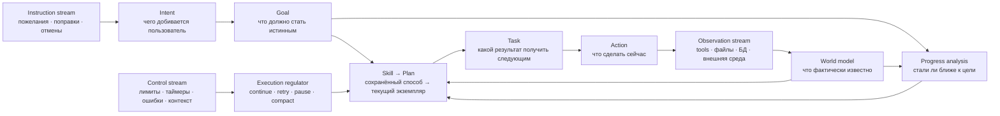
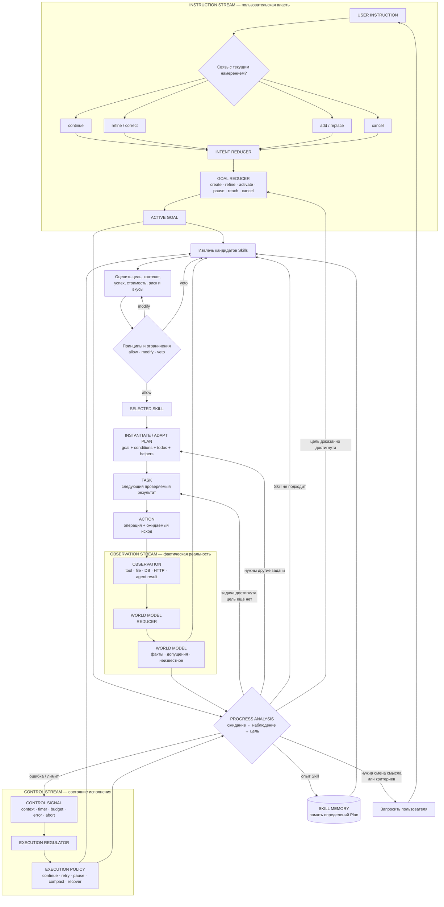
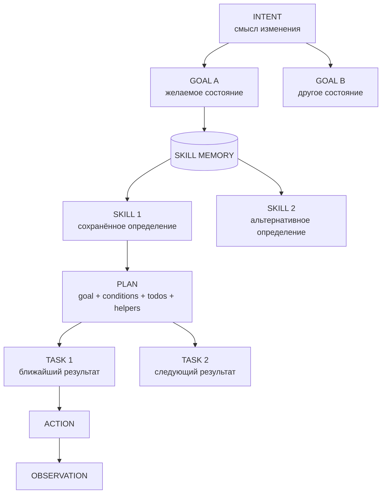
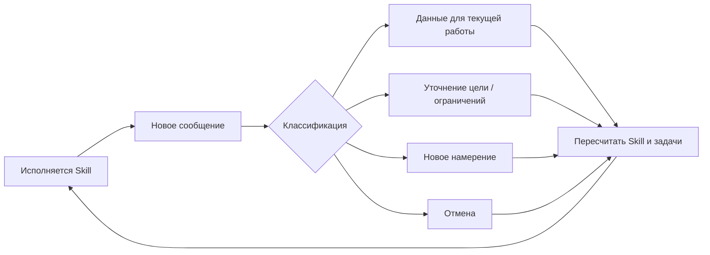
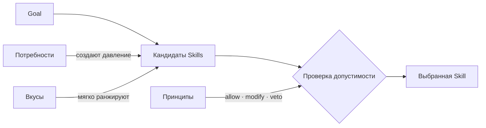
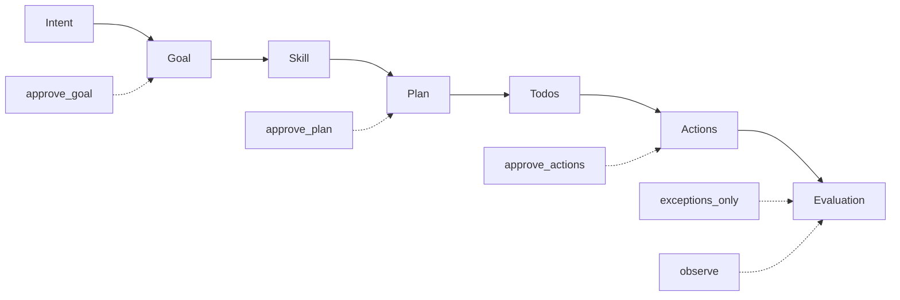
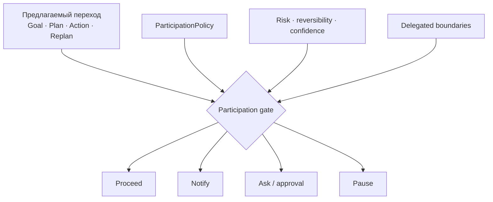
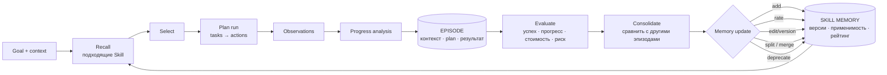
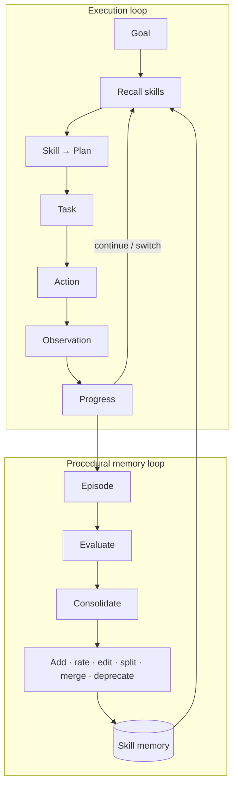

# Цикл агента: намерение → цель → skill → plan → задача

**Статус:** частично реализовано. Durable goals/checks, `session.plan` tasks, delegation и function/skill retrieval существуют; единый instruction→intent→skill orchestration и разделённые потоки ниже остаются концептуальным дизайном.

Этот документ описывает упрощённую модель работы агента с тремя раздельными входными потоками:

1. **instruction stream** — инструкции пользователя, которые создают, уточняют, переключают и отменяют намерения и цели;
2. **observation stream** — результаты действий и факты среды, которые обновляют модель мира и позволяют измерять прогресс;
3. **control stream** — внутренние сигналы исполнения: лимиты, таймеры, ошибки, давление контекста и прерывания.

Потоки не смешиваются в универсальный `event`. Они сходятся только при выборе Skill и исполнении Plan: цель приходит из instruction stream, фактическое состояние — из observation stream, режим и ограничения исполнения — из control stream.

Основная цепочка:

> **instruction → intent → goal → skill → plan → task → action → observation → progress analysis**

Параллельно:

> **control signal → execution regulation → plan/task/action**

Модель навеяна учебной схемой Вячеслава Дубынина: потребности и текущая ситуация участвуют в выборе поведенческой Skill, модель мира способна скорректировать или затормозить выбор, а ожидаемый результат сравнивается с фактическим. Это функциональная инженерная аналогия, а не попытка буквально воспроизвести отделы мозга.

---

## 1. Зачем нужна явная модель

Обычный LLM-цикл легко сводится к схеме «получить сообщение → сгенерировать следующий tool call». В ней теряются важные различия:

- буквальный текст сообщения смешивается с тем, чего пользователь добивается;
- действие принимается за цель;
- план строится без явного критерия завершения;
- новое сообщение может случайно заменить текущую работу;
- отсутствие ошибки инструмента принимается за успех;
- агент не накапливает знание о том, какие способы достижения целей работают;
- при неудаче агент повторяет действие, вместо того чтобы сменить Skill или перестроить Plan.

Явная цепочка разделяет смысл, желаемое состояние, способ достижения и конкретное исполнение. Раздельные потоки дополнительно не дают результату инструмента или внутреннему лимиту незаметно переписать пользовательское намерение.



Ключевая асимметрия: **только instruction stream авторитетно меняет пользовательское намерение**. Наблюдение может опровергнуть предположение, показать недостижимость цели или вызвать вопрос пользователю, но не должно само объявлять, что пользователь теперь хочет другого.

---

## 2. Сущности

### 2.1. Три входных потока

#### Instruction — инструкция пользователя

Инструкция — авторитетный вход от пользователя: сообщение, поправка, ограничение, подтверждение, отмена или смена приоритета. Только этот поток непосредственно управляет пользовательскими намерениями и целями.

```ts
type Instruction = {
  id: string
  messageId: string
  text: string
  receivedAt: string
  relation?: "continue" | "refine" | "correct" | "add" |
             "replace" | "cancel"
}
```

Инструкция сначала интерпретируется относительно текущего намерения. Фраза «кнопки пока не трогай» — не просто факт среды, а изменение границ полномочий и текущей цели.

#### Observation — наблюдение

Наблюдение — факт о мире или результате исполнения: tool result, состояние файла или БД, HTTP-ответ, результат теста, завершение дочернего агента. Наблюдения обновляют модель мира и служат доказательствами прогресса.

```ts
type ObservationInput = {
  id: string
  kind: "tool_result" | "environment" | "external_message" | "agent_result"
  payload: unknown
  observedAt: string
  sourceActionId?: string
}
```

Наблюдение не создаёт пользовательское намерение. Оно может показать, что цель достигнута, способ не работает или исходное предположение неверно; после этого агент продолжает, перестраивает Plan, меняет Skill либо просит пользователя уточнить цель.

#### ControlSignal — управляющий сигнал

Управляющий сигнал относится к состоянию исполнения, а не к желаемому пользовательскому результату.

Источники:

- рост активного контекста;
- лимит времени, токенов или стоимости;
- таймер и durable wake-up;
- ошибка, abort или неизвестный исход действия;
- блокировка зависимости;
- необходимость восстановления после падения.

```ts
type ControlSignal = {
  id: string
  kind: "context_pressure" | "budget" | "timer" | "error" |
        "abort" | "blocked" | "recovery"
  severity: number
  payload?: unknown
  occurredAt: string
}
```

Control stream регулирует способ исполнения: `continue`, `retry`, `pause`, `compact`, `delegate`, `recover`, `ask`. Он может породить служебную подцель, но не должен незаметно заменить пользовательскую цель.

Все три потока могут физически храниться в одном упорядоченном журнале для восстановления и аудита. Логическое требование — разные типы, разные reducers и разные права на изменение состояния:

```text
Instruction  → Intent / Goal
Observation  → World Model / Progress
ControlSignal → Execution Policy / Service Goals
```

### 2.2. Intent — намерение

Намерение — компактная гипотеза агента о том, **какого изменения пользователь добивается и зачем**.

Пример:

```text
Сообщение: «Хочу унифицировать UI».
Намерение: уменьшить визуальную и поведенческую разнородность интерфейса.
```

Намерение не обязано повторять формулировку пользователя. Оно связывает несколько сообщений, поправок и уточнений в одну смысловую линию.

Намерение должно быть представлено явно, но оставаться рабочей гипотезой:

```ts
type Intent = {
  id: string
  summary: string
  rationale?: string
  status: "inferred" | "confirmed" | "superseded" | "cancelled"
  confidence: number
  sourceInstructionIds: string[]
  createdAt: string
  updatedAt: string
}
```

Новая инструкция может:

- продолжить существующее намерение;
- уточнить его;
- скорректировать;
- породить подчинённое намерение;
- создать независимое намерение;
- заменить или отменить текущее.

Главный диагностический вопрос:

> Если выполнить новую инструкцию, это всё ещё приближает к тому же желаемому конечному состоянию?

Если да — скорее всего, это продолжение или коррекция. Если требуется другое конечное состояние — новое намерение.

### 2.3. Goal — цель

Цель — **желаемое проверяемое состояние мира**, сформированное из намерения с учётом текущего контекста.

```text
Намерение:
  уменьшить разнородность UI.

Цель:
  одинаковые по назначению элементы используют общие UI-примитивы и токены;
  существующее продуктовое поведение и доступность сохранены;
  проверки проходят.
```

Цель отвечает на вопрос «что должно стать истинным?», а не «что сделать?». Поэтому:

- «запустить тесты» — действие или задача;
- «тесты проходят» — состояние и возможный критерий цели;
- «прочитать код» — действие;
- «определено, где реализованы все варианты кнопок» — результат задачи.

```ts
type Goal = {
  id: string
  intentId: string
  desiredState: string
  successCriteria: string[]
  status: "candidate" | "active" | "paused" | "reached" |
          "cancelled" | "superseded"
  confidence: number
  createdAt: string
  updatedAt: string
}
```

Намерение может породить несколько целей, но у конкретного исполнительного контура должна быть одна активная цель. Остальные цели ожидают, приостановлены или подчинены активной.

Операции над целью:

- `create` — создать;
- `refine` — уточнить критерии без смены смысла;
- `replace` — заменить другим желаемым состоянием;
- `activate` — сделать исполняемой сейчас;
- `pause` — временно остановить;
- `reach` — отметить достигнутой по доказательствам;
- `cancel` — прекратить по решению пользователя или из-за потери актуальности.

### 2.4. Skill и Plan

Между целью и задачами находятся две связанные сущности:

- **Skill** — сохранённое переиспользуемое определение плана для класса целей;
- **Plan** — конкретный исполняемый экземпляр Skill, адаптированный под текущую Goal и контекст.

Skill отвечает на вопрос «какой известный способ обычно применим?». Plan — «как именно мы достигаем эту цель сейчас?».

Skill содержит не конкретную пользовательскую цель, а её шаблон, условия применимости, шаблон todo list и helper functions:

```ts
type Skill = {
  id: string
  version: number
  name: string
  description: string
  goalPattern: string
  applicableWhen: string[]
  contraindications: string[]
  todoTemplate: TodoTemplate[]
  helpers: HelperRef[]
  successWhen: string[]
  stopWhen: string[]
  replanWhen: string[]
  status: "candidate" | "active" | "deprecated"
}
```

Plan — полноценный исполнимый пакет:

> **Plan = Goal + Conditions + Todo List + Helper Functions.**

```ts
type Plan = {
  id: string
  skillId?: string
  skillVersion?: number
  goal: Goal
  conditions: {
    success: string[]
    stop: string[]
    replan: string[]
  }
  todos: Task[]
  helpers: HelperRef[]
  assumptions: string[]
  participation: ParticipationPolicy
  observations: string[]
  status: "active" | "paused" | "replanning" | "done" | "failed"
  startedAt: string
  finishedAt?: string
}
```

Skill memory хранит разные определения способов. Для конкретной Goal агент извлекает кандидатов, оценивает их и создаёт Plan. Plan может быть создан и без Skill, если подходящего сохранённого определения ещё нет.

При выборе Skill учитываются:

- соответствие шаблона текущей Goal;
- применимость к текущему состоянию мира;
- история успешных и неуспешных Plan runs;
- стоимость и длительность;
- риск нарушения целостности;
- предпочтения пользователя;
- принципы и ограничения;
- доступные capabilities, helpers и tools.

```text
score(skill) =
  goal_fit
  + context_fit
  + historical_success
  + preference_fit
  - cost
  - risk

principles(skill) → allow | modify | veto
```

Это эвристика, а не обязательная числовая формула. Выбранный Skill не исполняется вслепую: он сначала адаптируется в конкретный Plan.

### 2.5. Task — задача

Задача — ближайший ограниченный и проверяемый результат внутри текущего Plan.

```text
Цель:
  одинаковые элементы используют общие примитивы.

Plan:
  инвентаризация → выбор стандарта → пилот → постепенная миграция.

Задача:
  получить полный список существующих реализаций кнопок и мест их использования.
```

Задача отличается от действия:

- задача: «определить все реализации кнопок»;
- действие: вызвать `grep`;
- наблюдение: найдено пять компонентов;
- анализ: поиск охватил только `src/ui`, поэтому задача ещё не доказана как выполненная.

```ts
type Task = {
  id: string
  planId: string
  title: string
  expectedResult: string
  acceptanceCriteria: string[]
  status: "pending" | "active" | "blocked" | "done" | "cancelled"
  dependencies: string[]
}
```

Задачи могут быть созданы заранее или порождаться по ходу Plan. Важно не полнота первоначального плана, а наличие следующего проверяемого результата.

### 2.6. Action — действие

Действие — конкретная операция, выполняемая сейчас:

- вызов инструмента;
- изменение файла;
- запрос пользователю;
- ответ пользователю;
- ожидание события;
- запуск дочернего агента.

Перед изменяющим мир действием полезно фиксировать ожидаемый исход:

```ts
type Action = {
  id: string
  taskId: string
  operation: string
  arguments?: unknown
  expectedOutcome: string
  reversible: boolean
  status: "proposed" | "approved" | "running" | "succeeded" |
          "failed" | "outcome_unknown"
}
```

Отсутствие ошибки инструмента не доказывает достижение задачи. Tool call может успешно выполниться, но не приблизить агента к цели.

### 2.7. Observation — наблюдение

Наблюдение — факт, полученный после действия. Оно должно сохраняться отдельно от ожидания, чтобы агент не подменял реальность собственным прогнозом.

```ts
type Observation = {
  id: string
  actionId: string
  actualOutcome: string
  evidence: string[]
  confidence: number
  observedAt: string
}
```

Примеры доказательств:

- вывод теста;
- содержимое файла после изменения;
- строка БД;
- HTTP-ответ;
- сообщение пользователя;
- отсутствие ожидаемого события после заданного срока.

### 2.8. Progress analysis — анализ приближения

Анализ приближения замыкает цикл. Он сравнивает наблюдение не только с ожидаемым исходом действия, но также с задачей и основной целью.

```ts
type ProgressAnalysis = {
  actionMatchedExpectation: boolean
  taskDirection: "closer" | "unchanged" | "farther" | "reached"
  goalDirection: "closer" | "unchanged" | "farther" | "reached"
  evidence: string[]
  goalStillValid: boolean
  skillStillApplicable: boolean
  next: "continue" | "retry" | "replan_tasks" | "switch_skill" |
        "refine_goal" | "ask_user" | "pause" | "stop"
}
```

Возможные решения:

- продолжить текущий Plan следующей задачей;
- повторить действие с исправленными параметрами;
- перестроить todo list внутри того же Plan;
- выбрать другой Skill и создать новый Plan;
- уточнить или заменить Goal;
- запросить решение пользователя согласно ParticipationPolicy;
- завершить работу, если Goal достигнута;
- остановиться, если Goal отменена или стала недопустимой.

Результат анализа обновляет состояние исполнения: выбирается следующая задача, Skill или необходимость обратиться к пользователю. Он не поступает в instruction stream и сам по себе не переписывает намерение.

---

## 3. Полный замкнутый цикл



Критическое место схемы — не генерация действия, а разграничение полномочий:

- instruction reducer изменяет намерения и пользовательские цели;
- world-model reducer принимает факты, не приписывая пользователю новых желаний;
- execution regulator управляет режимом работы, не меняя смысл задачи;
- progress analysis выбирает продолжение Plan, перестроение Plan, смену Skill или вопрос пользователю;
- только ответ пользователя возвращается в instruction stream и авторитетно меняет намерение.

Критическое место схемы — не генерация действия, а переходы назад:

- от Task к текущему Plan;
- от Plan к выбору другого Skill;
- от анализа к Goal;
- от результата к интерпретации новой инструкции.

Без этих переходов агент умеет только настойчиво продолжать первоначальный план.

---

## 4. Соотношение инструкции, намерения, цели, Skill, Plan и задачи

| Сущность | Главный вопрос | Пример |
|---|---|---|
| Instruction | Что пользователь сейчас поручил или изменил? | «Унифицируй UI» |
| Intent | Какого изменения он добивается? | Уменьшить разнородность интерфейса |
| Goal | Что должно стать истинным? | Одинаковые элементы используют общие примитивы |
| Skill | Какой сохранённый способ использовать? | Инвентаризация → стандарт → пилот → миграция |
| Plan | Как Skill адаптирован к этой Goal? | Конкретные conditions, todos и helpers |
| Task | Какой ближайший результат нужен? | Найти все реализации кнопок |
| Action | Что сделать сейчас? | Выполнить поиск по компонентам |
| Observation | Что получилось фактически? | Найдено пять реализаций в трёх каталогах |
| Progress | Приблизились ли мы? | Да, но охват поиска ещё не доказан полным |
| Control signal | Нужно ли изменить режим исполнения? | Контекст заполнен на 85%, требуется compact |

Иерархия:



---

## 5. Новое сообщение во время исполнения

Агент не прекращает интерпретировать намерения после старта Plan. Новое сообщение пользователя может прийти между любыми двумя действиями.

Пример: активная цель — унифицировать UI. Пользователь пишет: «Кнопки пока не трогай».

Это:

- не новая независимая цель;
- не отмена унификации UI;
- уточнение границ текущего намерения;
- ограничение, которое делает часть Skills или задач неприменимой.

Агент должен:

1. остановиться перед следующим изменяющим действием;
2. принять сообщение в instruction stream;
3. связать инструкцию с текущим intent;
4. уточнить goal или его ограничения;
5. отменить затронутые задачи;
6. пересчитать кандидатов Skills;
7. сохранить уже полезный и непротиворечивый результат;
8. продолжить по обновлённой Skill.



Если уверенность низкая, а переключение дорого или необратимо, агент обсуждает интерпретацию с пользователем. Если можно сначала безопасно собрать дешёвые факты, он делает это до вопроса.

---

## 6. Потребности, вкусы и принципы

Эти сущности не заменяют намерение и цель. Они регулируют формирование и выбор поведения.

### Потребности

Потребность — динамический сигнал дефицита или давления, который может породить служебную цель.

Примеры для агента:

- результативность — приблизиться к пользовательскому результату;
- определённость — получить достаточно данных для обоснованного действия;
- целостность — не ухудшить значимое состояние и сохранить восстановимость;
- управляемость — сохранить контекст и ресурсы;
- достоверность — подтвердить соответствие факта ожиданию.

Пример внутреннего стимула:

```text
context usage вырос
→ дефицит управляемости
→ служебная цель: освободить активный контекст без потери значимого состояния
→ кандидаты Skills: compact, stash, delegate, завершить ветку
```

Служебная цель должна поддерживать пользовательскую, а не незаметно вытеснять её.

### Вкусы

Вкусы — мягкие предпочтения, меняющие рейтинг допустимых Skills.

Пример пользовательского вкуса:

```text
Предпочитать простые решения и функциональный стиль:
явные входы/выходы, композиция функций, минимум скрытого изменяемого состояния.
```

Вкус может уступить корректности или требованиям среды.

### Принципы

Принципы — устойчивые границы, способные изменить Skill или наложить veto.

Примеры:

- не выдавать предположение за проверенный факт;
- не раскрывать секреты;
- не совершать необратимое действие без достаточного основания;
- соблюдать явно заданные границы пользователя;
- сохранять возможность восстановления там, где это практически необходимо.



Кратко:

- потребность говорит **«надо изменить состояние»**;
- намерение — **«какого изменения добивается пользователь»**;
- цель — **«что должно стать истинным»**;
- Skill — **«каким способом идти»**;
- вкус — **«какой допустимый способ предпочтительнее»**;
- принцип — **«какие способы допустимы вообще»**.

---

## 7. Пример: унификация UI

### Исходное событие

```text
Пользователь: «Хочу унифицировать UI».
```

### Намерение

```text
Уменьшить визуальную и поведенческую разнородность интерфейса,
чтобы одинаковые элементы воспринимались и работали одинаково.
Статус: inferred.
```

### Первичная рабочая цель

```text
Одинаковые по назначению элементы используют общий небольшой набор
UI-примитивов и токенов; продуктовое поведение и доступность сохранены;
локальные дубли устранены в согласованной области миграции.
```

Эта цель может потребовать подтверждения после инвентаризации, потому что неизвестен масштаб: только токены, базовые компоненты или все экраны.

### Skill memory

| Skill | Когда подходит | Риск |
|---|---|---|
| Tokens first | Основная разнородность в цветах, размерах и отступах | Компонентные различия останутся |
| Component first | Много локальных реализаций одинаковых контролов | Большой diff |
| Screen by screen | Нужна постепенная безопасная миграция | Временная неоднородность |
| Pilot component | Высока неопределённость, нужен дешёвый эксперимент | Пилот может быть нерепрезентативным |

С учётом вкуса «проще и функциональнее» агент предпочитает небольшой набор функций, токенов и примитивов сложной универсальной дизайн-системе, если этого достаточно.

### Выбранная Skill

```text
Инвентаризация → определить минимальный стандарт → пилот на одном типе элемента
→ проверить → постепенно мигрировать остальные места.
```

### Первая задача

```text
Получить проверенный список существующих реализаций кнопок,
их вариантов, состояний и мест использования.
```

### Действие и ожидание

```text
Action: поиск определений и использований компонентов кнопок.
Expected outcome: список файлов и вариантов, достаточный для сравнения API и стилей.
```

### Наблюдение

```text
Найдено пять реализаций, но поиск выполнялся только в src/ui.
```

### Анализ приближения

```text
Action matched expectation: частично.
Task direction: closer.
Goal direction: closer.
Next: продолжить поиск в feature-каталогах; Plan не менять.
```

### Коррекция пользователя

```text
Event: «Кнопки пока не трогай».
Interpretation: уточнение границ текущего намерения.
Goal update: исключить кнопки из текущей области миграции.
Skill update: выбрать другой пилот, например поля ввода.
```

---

## 8. Инварианты модели

1. **Instruction, Observation и ControlSignal — разные потоки.** Только инструкция пользователя непосредственно управляет его намерением.
2. **Intent не считается фактом.** Это гипотеза с уверенностью и источниками.
3. **Goal описывает состояние, а не действие.**
4. **У активного исполнительного контура одна активная цель.** Параллельная работа требует отдельных контуров или явной координации.
5. **Skill и Plan находятся между goal и task.** Goal не должна напрямую порождать случайный tool call.
6. **Task имеет проверяемый expected result.**
7. **Action фиксирует ожидаемый исход до исполнения**, особенно для изменяющих мир операций.
8. **Observation хранится отдельно от expectation.**
9. **Tool success не равен task success.**
10. **Task success не равен goal success.**
11. **Progress analysis опирается на evidence.**
12. **Неудача действия не всегда требует смены Skill.** Иногда достаточно retry.
13. **Отсутствие прогресса может потребовать смены Skill, а не усиления настойчивости.**
14. **Новое сообщение может изменить intent или goal в любой момент.**
15. **Обучение обновляет Skill memory, но не переписывает историю наблюдений.**

16. **ParticipationPolicy задаёт пользовательскую границу decision rights.** Она не является частью Goal и может меняться независимо.
---

## 9. Уровень участия пользователя

Участие пользователя — не аварийная ветка и не единый «процент автономности агента». Это явная пользовательская настройка, определяющая, **в каких точках цикла агент обязан вернуть управление человеку**.

Пользователь может задать уровень прямо:

```text
«Показывай каждый шаг»
«Сначала согласуй план, потом делай сам»
«Цель понятна — работай автономно, спрашивай только по исключениям»
«Ничего не меняй, только предлагай»
```

Если уровень не задан, агент выводит рабочую политику из контекста, риска и установленных системных правил. Выведенная политика должна оставаться доступной для просмотра и изменения пользователем.

### 9.1. ParticipationPolicy

```ts
type ParticipationLevel =
  | "advise"          // агент только анализирует и предлагает
  | "approve_actions" // пользователь подтверждает значимые Actions
  | "approve_plan"    // пользователь утверждает Plan, затем агент исполняет
  | "approve_goal"    // пользователь утверждает Goal; Skill и Plan выбирает агент
  | "exceptions_only" // агент работает сам и обращается по исключениям
  | "observe"         // агент работает сам, пользователь получает отчёты

type ParticipationPolicy = {
  level: ParticipationLevel
  selectedBy: "user" | "inferred" | "system"
  alwaysAskFor: ActionClass[]
  notifyOn: NotificationClass[]
  pauseOn: ExceptionClass[]
  canUserInterrupt: true
}
```

`selectedBy: "user"` имеет приоритет над выведенным агентом уровнем. Системные ограничения могут требовать дополнительного approval, но не должны незаметно снижать запрошенное пользователем участие.

### 9.2. Уровни участия

| Уровень | Что решает пользователь | Что делает агент |
|---|---|---|
| `advise` | Выбирает Goal, Plan и Actions | Анализирует, предлагает варианты, не изменяет мир |
| `approve_actions` | Подтверждает значимые Actions | Формирует Goal и Plan, готовит следующий Action |
| `approve_plan` | Утверждает Goal и Plan | Сам выполняет утверждённые todos в границах Plan |
| `approve_goal` | Утверждает операциональную Goal | Сам выбирает Skill, строит и перестраивает Plan |
| `exceptions_only` | Решает неоднозначные и исключительные случаи | Ведёт цикл автономно в делегированных границах |
| `observe` | Наблюдает и может вмешаться | Работает автономно и сообщает заданные события |

Уровни образуют не столько лестницу доверия, сколько разные позиции пользователя в цикле:



### 9.3. Participation gate

Перед переходом через контролируемую точку Plan вычисляет решение:

```ts
type ParticipationDecision =
  | { kind: "proceed" }
  | { kind: "notify"; summary: string }
  | { kind: "ask"; question: string; options?: string[] }
  | { kind: "request_approval"; subject: "goal" | "plan" | "action" }
  | { kind: "pause"; reason: string }
```

Gate учитывает одновременно:

- выбранный пользователем уровень участия;
- класс текущего решения;
- стоимость и обратимость;
- внешние последствия;
- уверенность агента;
- выход за границы утверждённой Goal или Plan;
- `alwaysAskFor`, `notifyOn` и `pauseOn`;
- обязательные системные ограничения.



### 9.4. Участие может различаться по классам действий

Один уровень не обязан одинаково применяться ко всему Plan. Например:

```text
Goal: approve_goal
Read/Search: proceed
Edit reversible workspace files: proceed + notify
Commit: proceed if included in approved Plan
Push/Publish: request approval
Delete/Payment/External commitment: always ask
```

Это не нарушение модели уровней, а её уточнение через `alwaysAskFor`. Пользователь выбирает базовый уровень и может отдельно задать чувствительные действия.

### 9.5. Новая инструкция всегда может изменить участие

Instruction stream имеет высший пользовательский приоритет. В любой момент пользователь может:

- повысить участие: «остановись и сначала покажи Plan»;
- снизить участие: «дальше делай сам»;
- изменить исключения: «коммить сам, но перед push спрашивай»;
- остановить текущий Plan;
- отменить или заменить Goal.

Изменение ParticipationPolicy не обязано менять Intent или Goal. Оно меняет границы исполнения.

### 9.6. Когда агент сам инициирует обсуждение

Даже при низком участии агент обращается к пользователю, если:

- Intent допускает существенно разные Goals;
- критерии успеха зависят от продуктового или эстетического выбора;
- действие выходит за утверждённые границы;
- результат дорогой или необратимый;
- возник конфликт Goals или Principles;
- цена неверной интерпретации выше цены вопроса;
- агенту нужно принять обязательство от имени пользователя.

Если можно сначала получить дешёвые, безопасные и обратимые факты, агент делает это до вопроса — если ParticipationPolicy не требует более раннего согласования.

### 9.7. Прозрачность

Пользователь должен иметь возможность увидеть:

- обслуживаемое Intent;
- активную Goal;
- текущий Skill и Plan;
- выбранный уровень участия и его источник;
- какие решения требуют approval;
- почему Plan был перестроен;
- где агент ожидает пользователя.

Короткая формула:

> **Пользователь определяет, где он хочет находиться внутри agentic loop; агент исполняет Plan только в пределах этой границы.**

---

## 10. Минимальная реализация

Для первой версии не нужны отдельные LLM-агенты на каждый блок. Достаточно одного цикла с явным состоянием:

```ts
type AgentLoopState = {
  instructions: Instruction[]
  intents: Intent[]
  goals: Goal[]
  activeGoalId?: string
  worldModel: unknown
  controlState: unknown
  plan?: Plan
  participationPolicy: ParticipationPolicy
  tasks: Task[]
  currentAction?: Action
  lastObservation?: Observation
  lastProgress?: ProgressAnalysis
}
```

Один проход instruction stream:

```text
1. consume instruction
2. classify against active intent and goal
3. create/update intent
4. create/update/select active goal
5. trigger skill recall and plan reconsideration
```
6. apply ParticipationPolicy before activating a changed goal or plan

Один проход observation stream:

1. consume observation
2. update world model
3. compare actual outcome with action expectation
4. analyze task and goal progress
5. propose continue, rebuild plan, switch skill, mark reached, or ask
6. pass the transition through ParticipationPolicy

Один проход control stream:

```text
1. consume control signal
2. update execution pressure/state
3. select continue, retry, pause, compact, delegate, recover, or ask
4. preserve the active user goal unless an instruction changes it
```
5. never reduce user-selected participation without a new instruction

Не обязательно выполнять все шаги через отдельные LLM-вызовы. Механические переходы, проверки статусов, пороги контекста и расчёт статистики лучше делать процедурно. LLM нужен там, где требуется семантическая интерпретация:

- понять намерение;
- сформулировать цель;
- сопоставить Skill с новым контекстом;
- предложить задачу;
- объяснить расхождение ожидания и результата.

## 11. Цикл процедурной памяти

Skill memory — не статический каталог skills. Это отдельная **процедурная память**, которая собирает способы достижения целей, оценивает их по фактическим запускам и осторожно изменяет со временем.

Исполнительный цикл отвечает на вопрос **«что делать сейчас?»**. Цикл памяти отвечает на вопросы:

- какие способы уже известны для похожей цели;
- при каких условиях каждый способ применим;
- насколько он обычно успешен;
- сколько ресурсов требует и какие риски создаёт;
- какие шаги стоит исправить;
- когда создать новую Skill, разделить слишком общую или архивировать устаревшую.



### 11.1. Эпизод исполнения

Каждый значимый запуск Plan оставляет эпизод. Эпизод — неизменяемое свидетельство конкретной попытки, а не готовая универсальная инструкция.

```ts
type PlanEpisode = {
  id: string
  goalId: string
  skillId: string
  skillVersion: number
  contextSummary: string
  assumptions: string[]
  taskIds: string[]
  outcome: "success" | "partial" | "failure" | "unknown"
  goalProgress: "closer" | "unchanged" | "farther" | "reached"
  evidence: string[]
  cost?: { durationMs?: number; toolCalls?: number; tokens?: number }
  risksObserved: string[]
  createdAt: string
}
```

История эпизодов сохраняется даже после изменения Skill. Иначе нельзя объяснить её рейтинг, восстановить причины правки или переоценить старый опыт при появлении новых данных.

### 11.2. Skill и её рейтинг

Описание Skill следует отделить от накопленной статистики. Skill версионируется; статистика вычисляется из эпизодов и может быть пересчитана.

```ts
type Skill = {
  id: string
  version: number
  name: string
  description: string
  goalPattern: string
  applicableWhen: string[]
  contraindications: string[]
  todoTemplate: TodoTemplate[]
  helpers: HelperRef[]
  successWhen: string[]
  stopWhen: string[]
  replanWhen: string[]
  status: "candidate" | "active" | "deprecated"
  derivedFromEpisodeIds: string[]
}

type SkillRating = {
  skillId: string
  skillVersion: number
  attempts: number
  successes: number
  partials: number
  failures: number
  progressRate: number
  averageCost?: number
  confidence: number
  lastUsedAt?: string
}
```

Рейтинг не должен быть одним глобальным числом. Один способ может хорошо работать для маленького TypeScript-модуля и плохо — для большой миграции. Поэтому оценка должна учитывать класс цели и контекст применимости.

```text
candidate score =
  соответствие цели
  × соответствие текущему контексту
  × ожидаемая успешность
  + соответствие вкусам
  - стоимость
  - риск
  - штраф за слабые доказательства
```

### 11.3. Операции Skill memory

После консолидации память может выполнить одну или несколько операций:

1. **Add** — создать Skill-кандидат, если найден новый повторяемый способ.
2. **Rate** — обновить успешность, прогресс, стоимость, риск и уверенность.
3. **Edit/version** — выпустить новую версию с уточнёнными условиями или шагами.
4. **Split** — разделить слишком общий Skill, если он работает в разных контекстах по-разному.
5. **Merge** — объединить фактически одинаковые Skill.
6. **Deprecate** — убрать устаревший Skill из обычного recall, сохранив историю.
7. **Reactivate** — вернуть Skill при появлении нового подтверждающего опыта.

### 11.4. Исполнение не редактирует Skill напрямую

Один неудачный tool call не должен немедленно переписывать общий Skill. Правильная последовательность:

```text
plan run
→ immutable episode
→ evaluation
→ comparison with similar episodes
→ consolidation proposal
→ validated new version / rating update
```

Автоматическая правка допустима, когда изменение локально, обратимо и подтверждено несколькими согласованными эпизодами. Для существенных изменений нужны более сильные основания:

- повторяющийся паттерн успеха или неуспеха;
- явная причинная связь с конкретным шагом;
- подтверждение пользователя;
- внешний тест или проверяемое доказательство;
- ручное принятие новой версии для критичных Skills.

Так память не превращает случайность в правило и не закрепляет единичную ошибку как универсальное избегание.

### 11.5. Два сцепленных цикла



**Execution loop:** достигает текущей цели.  
**Procedural memory loop:** улучшает способы достижения будущих похожих целей.

Цикл памяти может выполняться не после каждого действия, а в естественных точках:

- завершение задачи;
- завершение или провал Plan;
- достижение цели;
- повторение похожей ошибки;
- периодическая фоновая консолидация;
- явная пользовательская оценка результата.

---

## 12. Возможное отображение на hyper-code2

Это направление для проектирования, не описание текущей реализации.

| Концепция | Возможное представление |
|---|---|
| Instruction stream | пользовательские `messages` с отдельной типизированной обработкой |
| Observation stream | tool results, результаты дочерних агентов, проверки файлов/БД/HTTP |
| Control stream | wake-ups, abort, run state, token/context pressure, recovery signals |
| Intent | отдельная компактная запись, связанная с исходными message idx |
| ParticipationPolicy | durable user/agent setting: базовый уровень + alwaysAskFor/notifyOn/pauseOn |
| Goal | расширение видимого plan/meta-состояния или отдельная сущность |
| World model | структурированная рабочая память с разделением фактов и допущений |
| Skill | `.hyper/skill/*`: сохранённое Plan Definition с goalPattern, conditions, todoTemplate и helpers |
| Plan | конкретный durable экземпляр Skill: Goal + conditions + todo list + helpers |
| Task / Todo | существующий `session.plan.tasks` с task IDs и статусами |
| Action | tool call с `tool_call_id` и ожидаемым исходом |
| Observation | tool result и последующие проверки |
| Progress analysis | отдельный структурированный результат после значимого шага |

| Participation gate | процедурная проверка перед activate Goal/Plan, внешним Action и существенным replan |

| Plan episode | неизменяемая запись goal/context/skill/plan/tasks/outcome/evidence |
| Memory consolidation | фоновый или завершающий проход, предлагающий add/rate/edit/split/merge/deprecate |
Текущее `session.plan` ближе всего к уровню **tasks**. Оно не должно одновременно изображать intent, goal, skill и полноценный plan: иначе теряется причина смены плана и невозможно отличить «задачи плохие» от «выбран неправильный способ» или «изменилась сама цель».

Skill memory целесообразно строить постепенно:

1. сначала — явные runtime skills и несколько встроенных стратегий;
2. затем — статистика запусков и результатов;
3. потом — извлечение по типу цели и условиям применимости;
4. только после накопления данных — автоматическое обобщение новых Skills.

---

## 13. Открытые вопросы

1. Должно ли одно намерение владеть несколькими параллельно активными целями или только очередью целей?
2. Где проходит граница между Skill как Plan Definition и адаптацией конкретного Plan?
3. Какие инструкции и control signals требуют немедленного прерывания текущего действия?
4. Как измерять прогресс для целей, не имеющих простого бинарного критерия?
5. Как хранить неуспех Skill, не создавая чрезмерного избегания?
6. Когда новый успешный Plan становится Skill в Skill memory?
7. Как разрешать конфликт пользовательской цели со служебной целью управляемости контекста?
8. Какие части intent/goal показывать пользователю постоянно, а какие — только по запросу?
9. Как версионировать цель, чтобы новые критерии не переписывали историю задним числом?
10. Как восстанавливать Plan после падения процесса и отличать незавершённое действие от действия с неизвестным исходом?

11. Какой объём доказательств достаточен для автоматического изменения Skill?
12. Должны ли рейтинги быть глобальными или вычисляться отдельно по классам целей и контекстам?
13. Какие Skills разрешено изменять автоматически, а какие требуют ручного принятия новой версии?
---
14. Должна ли ParticipationPolicy быть глобальной пользовательской настройкой, настройкой Intent или снимком внутри каждого Plan?
15. Какие классы Actions входят в `alwaysAskFor` по умолчанию и кто может менять этот список?
16. Как показывать пользователю фактическую границу участия без перегрузки UI?

## Итог

Минимальная осмысленная единица работы агента — не tool call и не универсальное событие, а взаимодействие трёх потоков вокруг исполнительного контура:

> **Инструкция пользователя интерпретируется относительно текущего намерения → намерение создаёт или меняет Goal → из Skill memory выбирается подходящее Plan Definition → Skill адаптируется в конкретный Plan (Goal + Conditions + Todo List + Helper Functions) → задачи реализуются действиями → наблюдения обновляют модель мира → анализ прогресса продолжает или перестраивает Plan, меняет Skill либо запрашивает новую инструкцию. Завершённый Plan сохраняется как эпизод; отдельная консолидация обновляет рейтинг или выпускает новую версию Skill. Control stream параллельно регулирует ресурсы и режим исполнения, не переписывая пользовательский смысл.**

Главные структурные решения:

> **Instruction → Intent → Goal → Skill → Plan → Tasks**, а не сообщение → список действий.

> **Observation → World Model → Progress**, а не tool result → новое намерение.

> **Control Signal → Execution Policy**, а не внутреннее давление → смена пользовательской цели.

> **ParticipationPolicy → approve / notify / proceed / pause** — пользователь задаёт своё место в цикле, а агент не пересекает эту границу молча.
Именно слой Skill + Plan позволяет агенту помнить разные способы достижения одной цели, переключаться между ними при отсутствии прогресса и обучаться не только отдельным действиям, но и стратегиям поведения.
