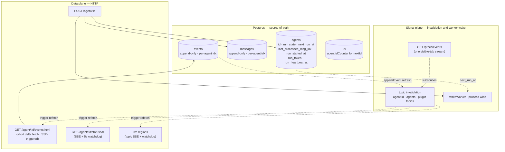

# Architecture

## Direction

## Declarative navigation apps

A module that owns a user-facing page can publish it to global navigation with a `$app_<name>.json` file. The `nav/$loader_app.ts` loader collects these declarations; `nav.items` merges them with core pages, plugins, and agents.

```json
{
  "label": "cron tasks",
  "href": "/cron",
  "hint": "page · durable background jobs",
  "icon": "ph-clock",
  "group": "System",
  "order": 80
}
```

`label` and `href` are required. `href` must be a local absolute path beginning with a single `/`. `icon` is an optional Phosphor class, `group` selects the global-menu section, and numeric `order` provides stable ordering among app declarations. Defaults are `ph-gear`, `System`, and `100`.

Core static pages use the same declarations as module pages; `nav.items` contains no hard-coded page catalogue. Dynamic plugin pages and agent chats continue to come from their own registries.


**Simplicity first. DB-first. Server-rendered HTMX fragments plus topic-filtered SSE invalidation. One in-process worker, runs agents in parallel.**

Everything durable lives in Postgres (paradedb). Everything visible to the user comes from a normal HTTP fetch. There is no queue table — debounce, renewable run lease and run state are columns on `agents`. Realtime uses one shared SSE connection in each visible browser tab; events carry topic invalidations only, and live regions refetch current HTML. Hidden tabs close SSE to avoid exhausting browser per-origin connections.



---

## Principles

1. **The DB is the source of truth.** Messages, events, run-state, scheduling — all in Postgres. Memory is only an execution cache.
2. **HTTP is the data plane.** Browser fetches visible state through normal short HTTP requests. SSE carries only coalesced invalidation signals; watchdog timers repair missed signals.
3. **Signals are not data.** SSE topics and `wakeWorker` carry no domain payload; consumers re-read Postgres or refetch canonical HTML. A lost invalidation is repaired by the live-region watchdog.
4. **One worker. No queue table. Parallel drain.** Run scheduling is two columns on `agents`: `next_run_at` (when to fire) and `run_state` (`'idle' | 'running'`). One in-process `workerLoop` claims every currently-eligible agent in a tight `claimOne()` loop and spawns each as its own promise — different agents run concurrently. Per-agent serialisation is enforced by Postgres row locking on `UPDATE … RETURNING` (two concurrent claims can't both win the same `idle` row), not by an in-memory lock.
5. **Small shared client controllers.** HTMX owns server fragments; shared scripts own SSE visibility, hotkeys, popup RPC and one disposable controller per chat panel.

---

## Channels at a glance

| Concern              | Channel                                           | Driven by                             |
|----------------------|---------------------------------------------------|---------------------------------------|
| Initial render       | SSR HTML from `GET /agent/:id`                    | server-rendered                       |
| New events appear    | short `GET /agent/:id/events.html?offset=N`       | `agent:<id>` SSE invalidation + 30s watchdog |
| Status & exec time   | `GET /agent/:id/statusbar`                        | `agent:<id>` SSE invalidation + 5s watchdog |
| Navigation refresh   | server fragment/live region                       | `agents` invalidation + watchdog      |
| User submits message | `POST /agent/:id?debounceSeconds=0.1`             | HTMX form submit                      |
| Delete a message     | `POST /agent/:id/messages/delete`                 | HTMX confirmation + POST              |
| Stop / fork / archive| route-backed controls                             | forms/HTMX                            |
| Global notifications | `GET /procs/events`                               | shared topic-filtered SSE client      |

---

## Send flow

```mermaid
sequenceDiagram
    participant B as Browser (htmx form)
    participant S as Server
    participant DB as Postgres
    participant W as workerLoop
    participant L as LLM

    B->>S: POST /agent/:id (text=hi)
    S->>DB: appendUserMessage → messages
    S->>DB: UPDATE agents SET next_run_at = MAX(curr, now+5s)
    S->>W: wakeWorker
    S-->>B: 204 No Content

    Note over W: claim via<br/>UPDATE agents SET run_state='running'<br/>WHERE id IN (SELECT … WHERE next_run_at <= now LIMIT 1)<br/>RETURNING id

    W->>DB: snapshot userFrontier = MAX(messages.idx) WHERE role='user'
    W->>L: stream(transcript)
    L-->>W: tokens / tool_calls
    W->>DB: appendAssistantMessage / appendEvent / …
    DB-->>S: appendEvent publishes topic agent:id
    S-->>B: SSE invalidation
    B->>S: short GET events.html?offset=N
    S-->>B: rendered delta + replacement tail
    W->>DB: fenced finalize WHERE run_token matches;<br/>set idle, clear lease, advance cursor on success,<br/>preserve/reschedule pending user work
    Note over W,DB: transient provider errors retry once;<br/>stale leases use bounded recovery backoff

POST is **one message INSERT + one agent UPDATE**. No queue row. No payload duplicate of the message text — the message itself is the input.

If two POSTs land within the debounce window, both rows are appended to `messages`, and `next_run_at = MAX(...)` keeps the run scheduled for the latest one. When the worker fires, both messages go to the LLM in one transcript — natural merge.

## Receive flow

The browser keeps one topic-filtered `GET /procs/events` stream only while the tab is visible. An `agent:<id>` invalidation triggers a short HTMX request to `/agent/:id/events.html?offset=N`; the route renders any delta and returns a replacement live tail. A 30-second watchdog catches missed signals after disconnects. Hidden tabs close SSE and catch up when visible again.


---

## Recovery

| Event | What happens |
|---|---|
| Browser refresh | SSR renders the latest event page and installs a live tail at the next offset. |
| Lost network | EventSource reconnects; visible regions refresh from their durable offsets. |
| Hidden tab | It closes SSE, then refreshes all visible topics and reconnects when foregrounded. |
| Server restart | `loadAll` rehydrates agents; renewable leases reclaim owners whose heartbeat expires. |
| Invalidation lost | 5s/30s watchdog requests canonical fragments again. |

---

## Run-state on the agents row

```sql
agents.next_run_at             BIGINT  -- ms epoch when work may be claimed
agents.last_processed_msg_idx  INTEGER -- cursor over real user messages
agents.run_state               TEXT    -- idle | running
agents.run_started_at          BIGINT  -- total elapsed display/audit
agents.run_token               TEXT    -- opaque fencing identity for current owner
agents.run_heartbeat_at        BIGINT  -- renewable liveness timestamp
agents.stale_recovery_count    INTEGER -- bounded stale retry counter
agents.last_error              TEXT
```

Rules:

- `POST` does `UPDATE agents SET next_run_at = MAX(COALESCE(next_run_at, 0), now + N)`. The `MAX` prevents an earlier message from rolling back an already-pushed-out run.
- The worker's atomic claim is `UPDATE agents SET run_state='running' WHERE id IN (SELECT id FROM agents WHERE run_state='idle' AND next_run_at <= now ORDER BY next_run_at ASC LIMIT 1) RETURNING id`. Postgres row locking makes this one-statement-atomic — two concurrent statements **cannot** both win the same row, so two parallel runners trying to grab the same agent will see exactly one `claimed.length === 1` and one `claimed.length === 0`.
- **Cursor scope is `role='user'` AND `excluded_from_cursor=0`.** Both the pre-run frontier snapshot and the post-run "still pending" check ignore excluded user rows. Native tool results use `role='tool'` and are not user input in the first place. Without this distinction, internal traffic could look like fresh input and make the worker re-run a completed conversation.
- `last_processed_msg_idx` only advances on **success**. Aborted or failed runs leave the cursor where it was. They also do **not** auto-reschedule (`next_run_at = NULL` on the failure path) — the user's next POST decides whether to retry. Otherwise a permanently broken LLM call would burn the worker in a tight loop.
- If new **real user** messages land while a run is in progress, the worker's `finally` block detects `MAX(idx) WHERE role='user' AND excluded_from_cursor=0 > cursor` and sets `next_run_at = now + 5s` again before returning to `idle`. Successful run → auto-rescheduling for the new input. Failed run → no rescheduling.

### Concurrent drain

`workerLoop` is one promise but it spawns N concurrent `runOne` promises:

```ts
while (workerLoopRunning) {
    let drained = 0;
    while (true) {
        const id = claimOne(ctx, Date.now());
        if (!id) break;
        drained++;
        const p = runOne(ctx, id).finally(() => inflight.delete(p));
        inflight.add(p);
    }
    if (inflight.size === 0)      await waitForWork(ctx, untilNextRunAt);
    else if (drained === 0)       await waitForWork(ctx, MAX_IDLE_MS);
    // else: keep draining until claimOne returns null
}
```

No artificial concurrency cap — backpressure comes from the LLM provider (429s, connection errors, retried in `streamCodex` / `streamAnthropic`) and Postgres serialising row writes. `runOne`'s `finally` calls `wakeWorker` so a finishing run unblocks the loop without waiting for the 30 s safety poll. Verified by `src/agent/workerLoop.test.ts` — three mock runs of 100 ms each land in ~150 ms wall-clock with overlapping intervals; serial would be ~300 ms with none.

---

## SSE invalidation and worker wake

UI and execution use separate signal planes:

- `procs.events`: one topic-filtered SSE stream per visible tab; `appendEvent` publishes `agent:<id>`, and clients coalesce matching live-region refreshes. Hidden tabs close the stream and catch up on return.
- `wakeWorker` + `workerLoop.waitForWork`: one process-wide condition variable that wakes the DB queue scanner after schedules/finalization change.

Both carry zero domain data. UI refetches canonical HTML/JSON; worker claims canonical DB rows.

The worker condvar is process-wide because there is one driver promise. Parallelism happens inside it through the `inflight` set; per-agent serialization and ownership remain in Postgres.

---

## Offsets and cursors

`events.idx` and `messages.idx` are per-agent monotonic integers. A live transcript tail carries its durable offset in `hx-get`; SSE only triggers a refresh and never owns cursor state:

```html
<div id="msg-tail"
     hx-get="/agent/:id/events.html?offset=N"
     data-live-topic="agent:id"
     hx-trigger="hyper-live from:body, every 30s"
     hx-swap="outerHTML">
</div>
```

The response contains new event HTML followed by a replacement tail whose offset is `max_event_idx + 1`. It waits for the next SSE invalidation or watchdog interval; it does not immediately long-poll again.

`session.getMaxEventIdx({ id })` returns the cursor head; `session.getEvents({ id, fromIdx, limit })` returns the slice.

---

## Sequential agent IDs

`ctx.fns.agent.nextId` returns `a, b, …, z, aa, ab, …` (base-26). Counter persisted in `kv(key='agent:idCounter')`. `start.ts` calls `nextId(ctx)` — no UUIDs, no `agent_<hex>` prefix.

---

## Native JSON tool calls

The provider receives native function schemas generated from the `$tool_*.md` registry. `agent.run` persists the assistant message with `tool_calls`, invokes every call through `tools.call`, then appends a `role='tool'` message carrying the matching `tool_call_id`. Tool arguments are validated against their declared JSON Schema before implementation code runs; unknown properties are rejected when `additionalProperties: false`.

The `eval` tool has a second validation layer for the TypeScript source inside its JSON `code` argument. Before execution, an in-process TypeScript Language Service checks a virtual eval file against the live project's `Context`, `Session`, generated `ctx.fns` declarations, Bun globals, and the typed `agent` binding. A type error prevents the complete eval body from running, including statements before the error. The compiler graph remains warm between calls, so only the virtual source revision is normally rechecked.

Typechecked eval is enabled by default. It can be disabled globally with declared setting `repl.typecheckEval=false` or environment variable `EVAL_TYPECHECK=false`; trusted internal callers can override one invocation with `procs.repl.eval({ code, typecheck: false })`. This is static checking, not runtime validation: values typed as `any` can still cross the boundary, so external JSON continues to rely on JSON Schema validation.

Tool results set `excluded_from_cursor=1`. `workerLoop`'s frontier query is `MAX(idx) WHERE role='user' AND excluded_from_cursor=0`, so tool traffic never looks like fresh user input and cannot schedule phantom runs.
---

## Settings — DB-backed key-value with scope

`src/settings/` is a generic key-value store keyed by `(module, scope_type, scope_id, key)`. Value is JSON-encoded; an `is_secret` flag is recorded but currently advisory only.

```sql
CREATE TABLE settings (
    module      TEXT NOT NULL,
    scope_type  TEXT NOT NULL,
    scope_id    TEXT NOT NULL DEFAULT '',
    key         TEXT NOT NULL,
    value       TEXT NOT NULL,
    is_secret   INTEGER NOT NULL DEFAULT 0,
    updated_at  INTEGER NOT NULL,
    PRIMARY KEY (module, scope_type, scope_id, key)
);
CREATE INDEX idx_settings_scope ON settings(scope_type, scope_id, module);
```

API: `ctx.fns.settings.{get, set, remove, list, getNumber, getString}`. `getNumber`/`getString` accept `fallback` — `getNumber` also rejects non-finite values (`NaN`, `Infinity`).

### Declared settings

Settings are *declared* with a typed descriptor in `$setting_<key>.ts` files (`{ type, default, env, options, min, max, title, description }`). Resolution per consumer:

1. **Explicit caller input** (e.g. POST `?debounceSeconds=…`, `opts.model`) — wins.
2. **DB row** for the requested `(module, scopeType, scopeId, key)`.
3. **`descriptor.env`** — env var bound in the declaration, parsed by type.
4. **`descriptor.default`** — hardcoded fallback in the declaration file.
5. **Caller `fallback`** — last resort, only when the descriptor doesn't supply one.

Shipping declarations:

| Declaration                            | Module · scope · key             | Used by                                                    |
|----------------------------------------|----------------------------------|------------------------------------------------------------|
| `src/llm/$setting_defaultModel.ts`     | `llm.global.defaultModel`        | `ui/createAgent.ts` and `$route_new_GET.ts` form pre-fill  |
| `src/llm/$setting_lmstudioBaseUrl.ts`  | `llm.global.lmstudioBaseUrl`     | `resolveEndpoint` for the `lmstudio:` provider             |
| `src/llm/$setting_<provider>ApiKey.ts` | `llm.global.<provider>ApiKey`    | `resolveEndpoint` per-provider auth                        |
| `src/agent/$setting_debounceMs.ts`     | `agent.global.debounceMs`        | `POST /agent/:id` default debounce (default `1000`)        |
|                                        | `ui.agent.<id>.debounceMs`       | per-agent override (no declaration; set via UI/REPL)       |

Forms at `GET /settings/declared` render every declaration with title/description/options for the user to tweak live.

---

## Mock LLM, no live network in tests

Per `CLAUDE.md`: every test uses `model: 'mock:*'` which routes through `src/llm/streamMock.ts`. Live integration tests for `streamOpenAI` are gated behind `LIVE_LLM=1` and **off by default**. `bun test` is deterministic and offline.

`agent.scratchpad.mockLLM = { echoUser, userToolCode, afterToolText }` controls mock behavior in tests.

The shared test fixture is `src/_testCtx.entry.ts` — `mkTestCtx()` returns a fully-wired `ctx` with `:memory:` DB + migrations + all common `ctx.fns.*` already populated. The `.entry.ts` suffix is skipped by the project scanner so the helper is **not** auto-registered as `ctx.fns.testCtx`.

---

## Navigation refresh

Navigation/menu fragments are server-rendered and refreshed from durable state. Writes publish the `agents` topic; watchdogs repair missed invalidations. Project links are derived from agent `workspace_dir`, and the Quick section uses durable `hot:<id>` timestamps.

---

## Remaining work (intentional gaps)

1. **Per-run audit/checkpoint ledger.** Inline lease state protects ownership but does not retain attempt-by-attempt timing, checkpoints and recovery history.
2. **Durable side-effect protocol.** External writes still need common idempotency keys, effect reconciliation and explicit unknown outcomes after crashes.
3. **Live thinking persistence.** Web chat persists final assistant output; mobile has transient in-memory prose, but durable low-cadence thinking/progress events are not a general contract.
4. **Context-tree memory.** Manual/sleep compaction exists; track/task/episode capsules and retrieval remain design work.
5. **Authorization scope.** Password/session authentication exists, but fine-grained per-agent/plugin authorization is not implemented.

---

## Why these choices

### Why no queue table?

A chat agent has exactly one input — the user's messages. A separate `agent_jobs` table was duplicating the input log and adding bookkeeping (`payload_json` carrying the same text already in `messages`, `debounce_until` per row when it logically belongs to the agent). One row in `messages` + two columns on `agents` carry the same information with less ceremony. When we later need genuine background workloads (`compact`, `delegate`, `cron`), we can introduce a typed `runs` or `jobs` table — for **runs**, not per-message scheduling.

### Why SSE invalidation instead of a stateful application WebSocket

The UI needs low-latency change notification, not a second copy of domain state. A shared topic-filtered EventSource carries invalidations; ordinary authorized HTTP requests fetch/replay canonical fragments by URL and offset. This keeps reconnect and correctness DB/HTTP-based while avoiding long-held HTMX requests.

### Why a single driver loop with parallel runs, not multiple worker loops

We **do** run agents in parallel — that's the whole point of the parallel-drain shape in `workerLoop`. What we don't do is spin up multiple competing driver loops. Two reasons:

- The bottleneck for actual parallelism is the LLM stream (`fetch` + SSE), and Bun event-loop already overlaps those across N concurrent `runOne` promises in one driver. A second driver loop would buy nothing the first one doesn't already cover.
- One driver = one place to track wake signals (`workerWakeWaiters`) and one mental model. Two drivers would race for claims, and we'd need extra coordination just so they don't claim the same row twice — exactly the problem we already solved with `UPDATE … RETURNING`, just twice over.

If writes ever become the bottleneck, we'd partition the agent space across multiple driver loops keyed on `agent_id % N`. Until then it's premature.

### Why htmx and not React/Datastar/etc

The DOM is already the right kind of stateful machine: append-only event log + tiny ephemeral form. htmx's `outerHTML` swap of `#msg-tail` is a one-line description of "infinite scroll backwards in time". Adding a frontend framework here is pure cost.

### Why no durable `agent.thinking.delta` channel

Live token deltas are transient data, while the shared SSE bus intentionally carries signal-only invalidations. The web transcript therefore persists/render final assistant output and uses an SSE-invalidated status fragment with a 5-second watchdog for liveness. A future thinking overlay should use bounded durable progress events rather than turning the invalidation bus into an alternate transcript.
