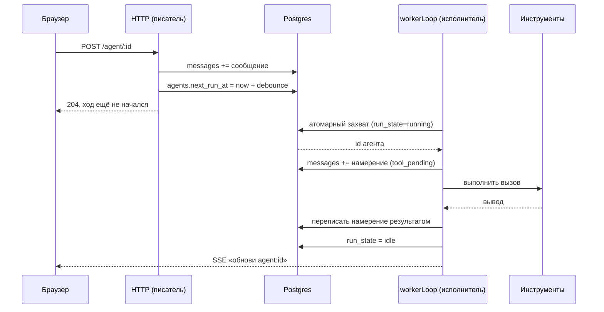
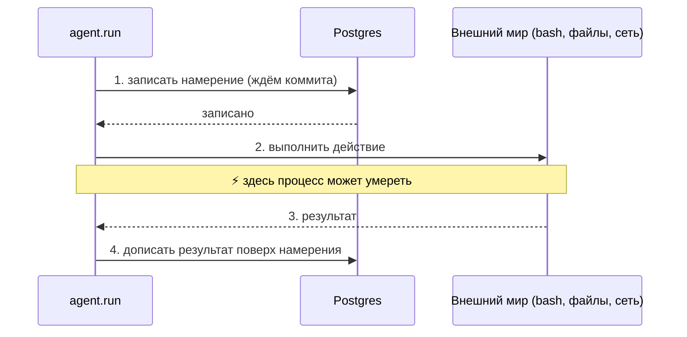
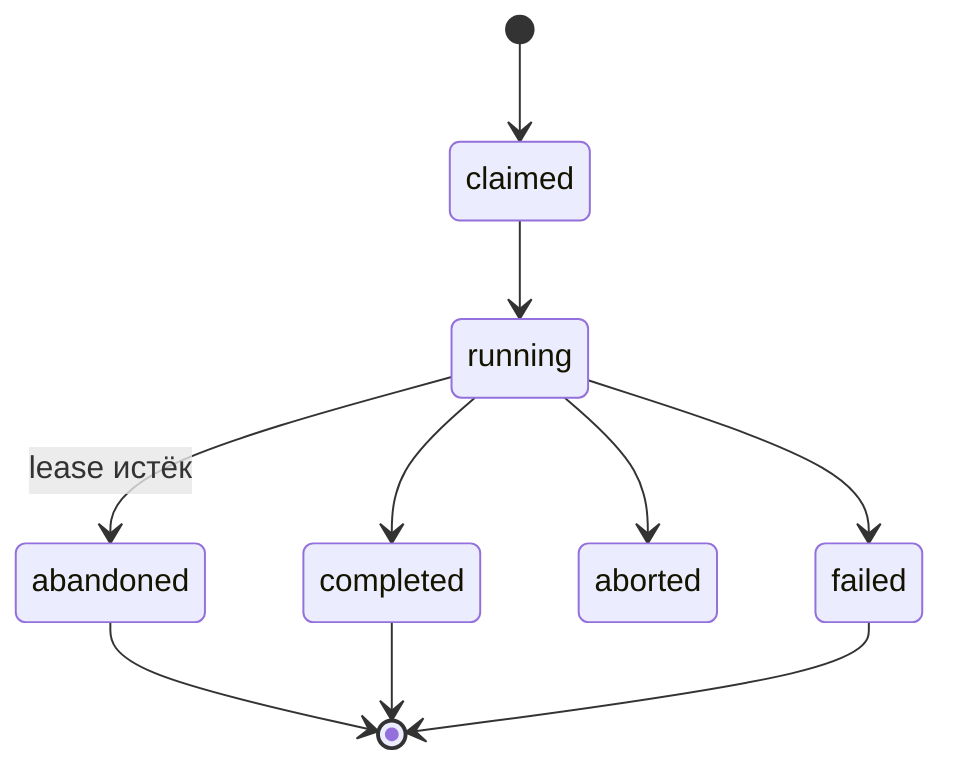
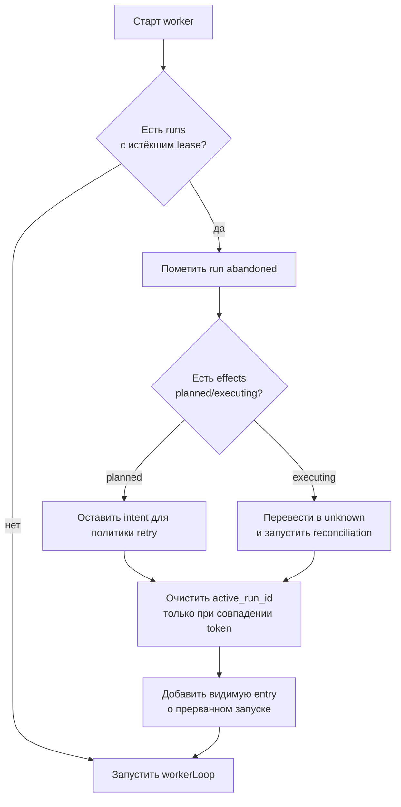
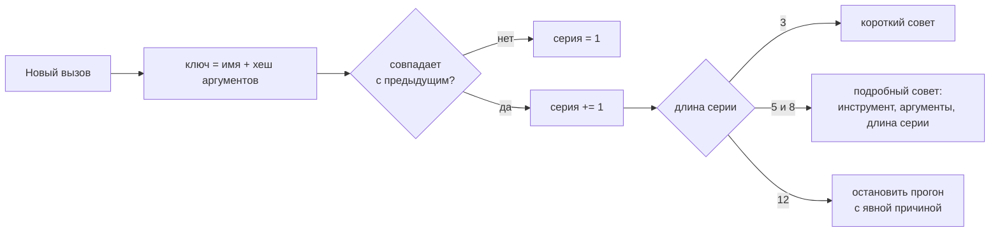
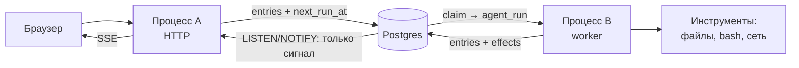

# Прогоны, которые переживают рестарт

Этот документ сочетает текущее состояние и дальнейший design. Renewable lease/fencing уже реализованы; полностью resumable run journal и reconciliation внешних эффектов остаются проектом.

## Как всё происходит сегодня, по шагам

Прежде чем менять — вот реальный путь одного сообщения, с настоящими именами функций и
запросами. Это важно, потому что половина нужных механизмов у нас уже есть.

1. **Браузер отправляет форму.** `POST /agent/:id` (`agent/$route_$id_POST.ts`).
2. **Сообщение ложится в базу.** `session.appendMessage` вставляет строку в `messages`,
   выделяя `idx` **внутри** INSERT (`SELECT COALESCE(MAX(idx),-1)+1 … RETURNING idx`) с
   ретраем на дубликат — поэтому два одновременных сообщения не столкнутся.
3. **Ставится время побудки.** Тот же роут делает
   `UPDATE agents SET next_run_at = GREATEST(COALESCE(next_run_at,0), ?)` — дебаунс: пока
   человек дописывает, окно сдвигается вперёд. HTTP-ответ на этом заканчивается, ничего
   ещё не выполняется.
4. **Воркер просыпается.** Единственный в процессе `workerLoop` (запущен из
   `agent/$start.ts`) видит побудку.
5. **Атомарный захват и fencing.** Worker устанавливает `run_state='running'`, `run_started_at`, `run_heartbeat_at` и случайный `run_token`, одновременно потребляя `next_run_at`. Одну строку может забрать только один claimant; heartbeat и finalize принимаются только при совпадении token.
6. **Загрузка и запрос к модели.** `agent.run` собирает историю и системный промпт,
   отдаёт провайдеру нативные схемы инструментов, читает поток.
7. **Намерение вызова.** На каждый tool call СНАЧАЛА вставляется строка-заглушка
   `role='tool'` с текстом «is running — interrupted before it reported back» и
   `tool_call_id`, и только потом выполняется `tools.call`.
8. **Результат.** `session.updateMessageContent` переписывает заглушку настоящим выводом;
   в `events` ложится карточка для UI.
9. **Цикл.** Если модель снова просит инструменты — обратно на шаг 6; если ответила
   прозой — ход закончен.
10. **Завершение.** `run_state='idle'`, курсор `last_processed_msg_idx` сдвигается, при
    необходимости ставится новый `next_run_at`.
11. **UI узнаёт.** `procs.events.refresh({topic:'agent:<id>'})` шлёт в SSE «обнови тему»,
    браузер перезапрашивает свои живые фрагменты.



**Что уже правильно.** Намерение tool call пишется до действия, захват атомарен, а `idx` устойчив к гонкам. Run имеет renewable heartbeat и `run_token`; stale recovery отзывает token, локально abort'ит прежнего владельца и ставит до трёх повторов с bounded exponential backoff. Поздний finalize старого владельца отбрасывается fencing-условием.

**Что ещё не закрыто:**

- Нет durable attempt/checkpoint journal, позволяющего продолжить model/tool loop точно после рестарта вместо повторного прохода.
- Успешно завершённые внешние side effects не имеют общего idempotency/reconciliation protocol; повтор пользовательского сообщения может воспроизвести write tool.
- Pending tool row честно показывает interruption, но общий runtime не различает `not_started`, `unknown` и подтверждённо выполненный эффект.
- `run_token` fence защищает состояние очереди/finalize, но не может физически остановить произвольный внешний процесс, который игнорирует AbortSignal.

Остальная часть документа описывает следующий уровень durability поверх уже работающего renewable lease.

## Главное правило

**Если действие произошло, то запись о намерении его сделать точно существует.**

Гарантия односторонняя, и это сделано специально. Запись может существовать для действия,
которое так и не началось — это нормально, при восстановлении мы честно скажем «исход
неизвестен». А вот обратное — действие, о котором нет записи, — делает падение
неисправимым, и допускать этого нельзя никогда.

Из правила следуют три требования:

1. Запись о намерении **закоммичена в базу до того**, как действие началось.
2. Операция берётся в **скобки**: маркер открытия пишется первым, маркер закрытия —
   последним. Падение в середине оставляет незакрытую скобку — это улика, а не бодрое
   «всё завершилось».
3. Восстановление ничего не **помнит**, а **выводит** из журнала. Счётчики, промисы и
   `WeakMap` в памяти процесса — это координация внутри одного прогона, но никогда не
   запись факта.

### Почему односторонняя гарантия работает



Падение возможно в любой точке. Если оно случилось между 1 и 4, в базе осталось
намерение без результата — мы это увидим. Обратной ситуации, когда действие выполнилось,
а следов нет, быть не может: запись всегда раньше.

## Что у нас уже есть

`agent.run` перед вызовом инструмента вставляет строку-заглушку
(«*eval is running — interrupted before it reported back*»), а после выполнения
переписывает её настоящим результатом. Это и есть запись намерения вперёд действия —
то есть половина WAL у нас работает уже сегодня. План ниже в основном делает её явной,
единообразной и, главное, разбираемой при старте.

## 1. `agent_runs`: кто и что выполняет

Целевая единица восстановления — не PID процесса и не строка сообщения, а отдельная
**попытка выполнить агента**. При каждом claim worker создаёт новую строку:

```sql
CREATE TABLE agent_runs (
  id                   uuid PRIMARY KEY,      -- uuidv7
  agent_id             text NOT NULL REFERENCES agents(id) ON DELETE CASCADE,
  retry_of              uuid REFERENCES agent_runs(id),
  status                text NOT NULL,         -- claimed|running|completed|failed|aborted|abandoned
  input_from_seq        bigint NOT NULL,
  input_through_seq     bigint NOT NULL,
  consumed_through_seq  bigint,
  worker_id             text NOT NULL,
  fencing_token         bigint NOT NULL,
  lease_until           bigint NOT NULL,
  heartbeat_at          bigint NOT NULL,
  started_at            bigint NOT NULL,
  finished_at           bigint,
  error                 text
);
```

`agents` хранит только горячую проекцию: `active_run_id`, `next_run_at`,
`last_consumed_seq`, `next_entry_seq` и `fencing_token`. Очередь остаётся в `agents`; эта
таблица не заменяет её, а объясняет каждую попытку выполнения.

Claim происходит одной транзакцией: worker блокирует готового агента, увеличивает
`fencing_token`, фиксирует входную границу, создаёт `agent_run` и ставит
`agents.active_run_id`. Живой run продлевает `heartbeat_at` и `lease_until` по часам БД.
Если lease истёк, recovery помечает строку `abandoned`, а retry создаёт **новую** строку с
`retry_of`.

Lease сам по себе недостаточен: старый worker может ожить после паузы. Поэтому каждая
запись результата проверяет одновременно `active_run_id` и `fencing_token`. Несовпадение
означает, что worker потерял право писать, даже если его запрос уже выполнялся.



## 2. Границы запуска и единый журнал

В целевой схеме `messages` и `events` заменяет append-only таблица `entries`. Границы
запуска видны двумя способами:

- в `agent_runs` лежат status, времена и входной диапазон;
- у каждой созданной записи есть `run_id`.

Отдельные `turn/start` и `turn/end` не нужны для восстановления: они дублировали бы
строку run и могли бы разойтись с ней. Если UI нужен lifecycle-факт, он добавляется как
обычная entry `kind='status'`, `for_ui=true`, но источником статуса остаётся `agent_runs`.

## 3. Намерение и результат инструмента

История больше не переписывается. Перед вызовом создаются:

1. `entries(kind='tool_call', run_id=...)` — что попросила модель;
2. `effects(status='planned', caused_by_entry_id=...)` — durable intent внешнего действия.

Только после commit вызывается инструмент. По завершении effect становится `succeeded`
или `failed`, а результат добавляется отдельной entry `kind='tool_result'` со ссылкой
`caused_by_entry_id` на tool call. Так append-only журнал остаётся правдивым и не зависит
от распознавания текста заглушки.

## 4. Что такое «исход неизвестен»

Если процесс умер после начала effect, но до записи результата, локальная база не знает,
принял ли внешний мир действие. Recovery переводит effect из `executing` в `unknown` и:

1. проверяет результат у получателя по `idempotency_key` или `external_ref`;
2. при наличии доказательства пишет `reconciled` и `tool_result`;
3. при отсутствии доказательства не повторяет опасное действие автоматически, а отдаёт
   агенту явное сообщение об неопределённости.

Главное правило сохраняется: **effect intent обязан быть закоммичен до side effect**.
Exactly-once возможен только при поддержке со стороны получателя; без неё честный статус —
`unknown`.
## 5. Проход восстановления

Recovery ищет `agent_runs.status IN ('claimed','running')` с истёкшим `lease_until` и
работает идемпотентно:



Recovery не продолжает старую попытку: новый claim создаёт новый `agent_run` с новым
fencing token. Повторный проход ничего не меняет, потому что abandoned run и обработанные
effects больше не подходят под исходный предикат.

## 6. `effects`: все действия за границей транзакции

Tool calls и фоновая работа используют одну durable-модель:

```sql
CREATE TABLE effects (
  id                   uuid PRIMARY KEY,
  agent_id             text NOT NULL REFERENCES agents(id) ON DELETE CASCADE,
  run_id               uuid REFERENCES agent_runs(id),
  caused_by_entry_id   uuid REFERENCES entries(id),
  kind                 text NOT NULL,
  idempotency_key      text NOT NULL,
  request              jsonb NOT NULL,
  status               text NOT NULL,
  result               jsonb,
  external_ref         text,
  fencing_token        bigint NOT NULL,
  started_at           bigint NOT NULL,
  heartbeat_at         bigint,
  finished_at          bigint,
  UNIQUE (kind, idempotency_key)
);
```

Для single-flight отдельной фоновой задачи ключ выбирается стабильным, например
`telegram.reauth:<account>`. Для внешнего API тот же ключ передаётся получателю. Пробуждение,
HTTP POST и tool call отличаются `kind` и политикой reconciliation, но подчиняются одному
инварианту intent-before-effect.

## 7. Детектор циклов без единого счётчика

Никаких `WeakMap` и счётчиков: транскрипт уже содержит все вызовы, поэтому цепочка
повторов — это запрос по его хвосту. Берём последние вызовы, канонизируем аргументы
(глубокая сортировка ключей + `JSON.stringify` + хеш) и считаем длину серии одинаковых
пар `(имя, хеш)`.



Правила, о которых договорились:

- отклонённые и упавшие вызовы **считаются** — агент, долбящийся в ошибку, это ровно тот
  цикл, который стоит рвать;
- служебные вызовы (записи плана, todo) **прозрачны**: не увеличивают и не сбрасывают
  серию, иначе цикл отмывается чередованием;
- настоящее сообщение пользователя сбрасывает серию;
- вызов сразу после «исхода неизвестен» законен и не считается;
- совет приходит как сообщение с `excluded_from_cursor: true` — тем же механизмом, что
  уже используют goal-фидбек и status line.

Такой детектор переживает рестарт по построению: у него вообще нет состояния.

## 8. Второй воркер: писатель и исполнитель порознь

Модель межпроцессная по построению: claim и `next_entry_seq` сериализуются строкой агента,
run защищён lease + fencing, effects имеют idempotency keys.



При нескольких исполнителях claim использует `FOR UPDATE SKIP LOCKED`; все сравнения
lease делаются по часам БД. `NOTIFY` не переносит данные — получатель всегда перечитывает
`entries` и `agent_runs`. Исполнители должны иметь доступ к workspace агента; перенос на
разные машины потребует отдельной абстракции файловой системы и subprocess runtime.
## 9. Что говорит индустрия (и что мы из-за этого меняем)

Тема называется **durable execution**, у неё есть зрелые движки (Temporal, Restate,
Inngest, Hatchet, DBOS, Cloudflare Workflows, Azure Durable Task) и уже отдельная ветка
про агентов. Ниже — только то, что меняет наш план.

### Главная развилка: мы восстанавливаемся чтением, а не перезапуском

Классические движки восстанавливаются **повторным исполнением функции с начала**, подставляя
запомненные результаты уже выполненных шагов. Это требует **детерминированного потока
управления** — поэтому Temporal делит код на `workflow` (детерминированный) и `activity`
(побочные эффекты), и поэтому LangGraph честно предупреждает, что после `interrupt` код
до него может выполниться повторно.

Нам этот путь закрыт: **поток управления у нас — сама модель**, она недетерминирована по
определению. Но нам он и не нужен, потому что решения модели уже записаны как данные в
транскрипте. Отсюда формулировка, которую стоит закрепить:

> Движки восстанавливают состояние, **переигрывая код**. Мы восстанавливаем состояние,
> **читая журнал**. Поэтому «исход неизвестен» — не костыль, а следствие архитектуры:
> переигрывать нечего и незачем.

### Что стоит добавить в план

1. **Реконсиляция по таймеру, а не только при старте.** В однопроцессном мире прохода при
   загрузке хватало. С двумя воркерами умерший исполнитель никого не «перезапускает»:
   второй процесс жив и о смерти первого не узнает. Поэтому `recover()` должен крутиться
   периодически (раз в минуту), а не только в `$start.ts`. В обзорах это называют
   *periodic reconciliation* и ставят рядом с журналом и идемпотентностью.
2. **Ключи идемпотентности там, где принимающая сторона их понимает.** Мы решили никогда
   не перезапускать — верно для `bash`. Но у внешних вызовов (telegram send, создание PR,
   любой HTTP) есть стандартный приём Stripe: передать ключ, и повтор будет опознан на той
   стороне. Стабильный ключ создаётся вместе с `effect` и при наличии API позволяет
   доспросить или безопасно повторить результат.
3. **Квитанция, а не только результат.** Записывать после успеха маленькую квитанцию:
   код возврата, сколько байт записано, sha коммита. Это превращает «проверьте сами» в
   «сравните с квитанцией» и резко удешевляет разбор неизвестного исхода.
4. **Версии — часть корректности, а не телеметрия.** Модель, хеш системного промпта, хеш
   схем инструментов, версия политики: если между попытками что-то из этого изменилось,
   продолжение расходится с началом. Это ровно `request/header` из обзора dsh — два
   независимых источника сошлись, значит поднимаем приоритет.
5. **Одобрения человека должны быть долговечными.** Кто одобрил, когда, **что именно
   видел** (хеш команды или патча), срок годности, переживает ли перезапуск. У нас
   `secureInput` живёт в памяти — и мы уже поймали этим цикл в telegram. Место для этой
   записи — таблица `effects`.
6. **Бюджет ретраев на весь прогон.** Ретраи вкладываются друг в друга: модель повторяет
   вызов, наш код повторяет запрос, провайдер повторяет внутри себя. Поэтому счётчик
   должен быть на прогон целиком, а не на вызов — детектор циклов из §7 стоит считать
   первой половиной этого бюджета.
7. **`effects` — это outbox.** «Записать намерение в одной транзакции, отправить наружу
   отдельным диспетчером» — известный паттерн transactional outbox; наша таблица уже такой
   формы, стоит просто называть вещи своими именами.

### Про `LISTEN/NOTIFY` — важная оговорка

Проверил по документации Postgres: уведомления доставляются **только при коммите**
транзакции и **только тем сессиям, которые слушают прямо сейчас**; пропустивший их клиент
не получит их никогда, а внутри транзакции доставка откладывается до её конца. Значит
`NOTIFY` можно использовать **только как подсказку «посмотри в журнал»**, а корректность
обязана держаться на самом журнале и сторожевом опросе. Это в точности та модель, к
которой мы пришли в UI («обнови тему» — сигнал, интервал — сторож), так что менять ничего
не нужно, но полагаться на доставку — нельзя.

### Проверка на прочность

Отдельный урок из обзоров агентных рантаймов: **тесты должны намеренно убивать процесс в
худший момент**. Не «вставим строку, будто мы упали», а поднять сервер подпроцессом,
дождаться начала долгого `bash`, послать `SIGKILL`, поднять заново и проверить, что
effect получил `unknown`, старый `agent_run` стал `abandoned`, а новый worker не принял
поздний результат со старым fencing token.

### Источники

- Jack Vanlightly, [Demystifying Determinism in Durable Execution](https://jack-vanlightly.com/blog/2025/11/24/demystifying-determinism-in-durable-execution) — почему детерминизм нужен потоку управления и не нужен эффектам
- [Durable Execution for AI Agent Runtimes: Checkpointing, Replay, and Recovery](https://zylos.ai/research/2026-04-24-durable-execution-agent-runtimes/) — обзор движков и агентных фреймворков; раздел про «чекпойнты без дисциплины побочных эффектов»
- [Temporal](https://docs.temporal.io/), [Restate](https://docs.restate.dev/concepts/durable_execution/), [DBOS](https://docs.dbos.dev/why-dbos) — три разных ответа: детерминированный реплей, журнал шагов, состояние прямо в Postgres
- [Stripe idempotent requests](https://docs.stripe.com/api/idempotent_requests) — эталон ключей идемпотентности
- PostgreSQL, [NOTIFY](https://www.postgresql.org/docs/current/sql-notify.html) — семантика доставки
- Consensus (10 работ): *Durable functions: semantics for stateful serverless* (2021), *Serverless Workflows with Durable Functions and Netherite* (2021), *Efficient Fault Tolerance for Pipelined Query Engines via Write-ahead Lineage* (2024), *Reliable Event-Driven Processing: Stage-Aware Retries, Idempotency, and Exactly-Once Semantics* (2026) — вывод один: «ровно один раз» не даёт ни один механизм по отдельности, это всегда слой из журнала, чекпойнтов, идемпотентных интерфейсов и дедупликации

## 10. Порядок работ

1. **`agent_runs` + lease + heartbeat + fencing.** Сначала сделать ownership и recovery
   наблюдаемыми, не меняя текущий transcript.
2. **`effects` и неизвестный исход.** Intent до действия, idempotency key и reconciliation.
3. **`entries`.** Backfill и dual-write из `messages/events`, затем переключение LLM и UI
   на единый журнал.
4. **Поколения, форки и artifacts.** Версионная история и spill больших результатов.
5. **Детектор циклов.** Считать последовательность по entries внутри run.

## 11. Как это проверять

- worker A получает run и fencing token; после истечения lease worker B создаёт retry;
  поздняя запись A отвергается;
- crash после `effect.planned` не выполняет действие самопроизвольно;
- crash после `effect.executing` даёт `unknown`, а recovery идемпотентен;
- завершённый run двигает cursor ровно до `consumed_through_seq`, failed run — нет;
- LLM и UI до и после перехода на `entries` получают эквивалентные проекции;
- tool call/result физически связаны, поэтому результат не может потеряться только в UI.

## 12. Чего это стоит

- строка `agent_runs` на каждую попытку и heartbeat-UPDATE во время долгого выполнения;
- краткая блокировка строки агента при выдаче `seq` и claim;
- fencing-проверка на каждой записи результата;
- отдельная дисциплина lifecycle для effects и reconciliation;
- временный dual-write при миграции единого журнала.

Взамен рестарт перестаёт терять ownership, поздний worker не портит новый run, а исход
каждого внешнего действия остаётся объяснимым.
