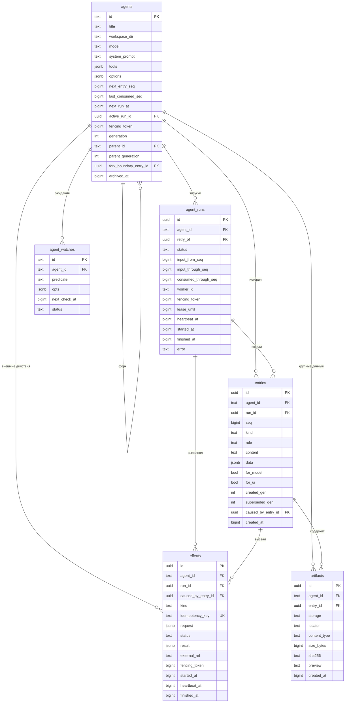

# Схема базы: что есть и к чему идём

Документ разделяет **текущую live-схему** и целевой дизайн. Некоторые ранние элементы уже реализованы — visibility, renewable run lease/fencing, watches, cron, attachments, OAuth/local secrets и provider state — но UUID event log, полноценный run journal, durable effect ledger и context tree остаются проектом.


## Что есть сегодня

<table style="width:100%;border-collapse:collapse;font-size:13px">
<thead><tr style="text-align:left;border-bottom:2px solid #e5e7eb">
<th style="padding:6px 8px">таблица</th><th style="padding:6px 8px">кол.</th>
<th style="padding:6px 8px">колонки</th><th style="padding:6px 8px">роль</th></tr></thead><tbody>
<tr style="border-bottom:1px solid #f3f4f6;vertical-align:top"><td style="padding:6px 8px"><code style="background:#f3f4f6;padding:1px 5px;border-radius:4px">agents</code></td><td style="padding:6px 8px;color:#6b7280">33</td><td style="padding:6px 8px;color:#374151">id, model, system_prompt, tools, scratchpad, parent_id, fork_offset, visibility, run_state, next_run_at, run_started_at, run_token, run_heartbeat_at, stale_recovery_count, last_processed_msg_idx, reflection, goal, sleep_context, wake_at, …</td><td style="padding:6px 8px;color:#6b7280">агент: личность, конфиг, очередь, renewable lease и фичи</td></tr>
<tr style="border-bottom:1px solid #f3f4f6;vertical-align:top"><td style="padding:6px 8px"><code style="background:#f3f4f6;padding:1px 5px;border-radius:4px">messages</code></td><td style="padding:6px 8px;color:#6b7280">12</td><td style="padding:6px 8px;color:#374151">agent_id, <b>idx</b>, role, content, ts, tool_calls, tool_call_id, message_type, <b>id</b> bigint identity, excluded_from_llm, excluded_from_cursor, provider_state</td><td style="padding:6px 8px;color:#6b7280">история модели и replayable provider state</td></tr>
<tr style="border-bottom:1px solid #f3f4f6;vertical-align:top"><td style="padding:6px 8px"><code style="background:#f3f4f6;padding:1px 5px;border-radius:4px">events</code></td><td style="padding:6px 8px;color:#6b7280">5</td><td style="padding:6px 8px;color:#374151">agent_id, <b>idx</b>, type, payload <i>text</i>, ts</td><td style="padding:6px 8px;color:#6b7280">лента, которую видит человек</td></tr>
<tr style="border-bottom:1px solid #f3f4f6;vertical-align:top"><td style="padding:6px 8px"><code style="background:#f3f4f6;padding:1px 5px;border-radius:4px">agent_watches</code></td><td style="padding:6px 8px;color:#6b7280">13</td><td style="padding:6px 8px;color:#374151">id, agent_id, predicate, opts, interval_ms, next_check_at, timeout_at, status, attempts, …</td><td style="padding:6px 8px;color:#6b7280">условные пробуждения</td></tr>
<tr style="border-bottom:1px solid #f3f4f6;vertical-align:top"><td style="padding:6px 8px"><code style="background:#f3f4f6;padding:1px 5px;border-radius:4px">settings</code></td><td style="padding:6px 8px;color:#6b7280">7</td><td style="padding:6px 8px;color:#374151">module, scope_type, scope_id, key, value, is_secret, updated_at</td><td style="padding:6px 8px;color:#6b7280">объявленные настройки</td></tr>
<tr style="border-bottom:1px solid #f3f4f6;vertical-align:top"><td style="padding:6px 8px"><code style="background:#f3f4f6;padding:1px 5px;border-radius:4px">kv</code></td><td style="padding:6px 8px;color:#6b7280">2</td><td style="padding:6px 8px;color:#374151">key, value</td><td style="padding:6px 8px;color:#6b7280">служебная память приложения</td></tr>
<tr style="border-bottom:1px solid #f3f4f6;vertical-align:top"><td style="padding:6px 8px"><code style="background:#f3f4f6;padding:1px 5px;border-radius:4px">oauth_credentials</code></td><td style="padding:6px 8px;color:#6b7280">9</td><td style="padding:6px 8px;color:#374151">provider, access_enc, refresh_enc, expires_at, scopes, metadata, version, …</td><td style="padding:6px 8px;color:#6b7280">зашифрованные токены</td></tr>
<tr style="border-bottom:1px solid #f3f4f6;vertical-align:top"><td style="padding:6px 8px"><code style="background:#f3f4f6;padding:1px 5px;border-radius:4px">functions</code></td><td style="padding:6px 8px;color:#6b7280">21</td><td style="padding:6px 8px;color:#374151">name, namespace, doc, signature, params_schema, embedding, …</td><td style="padding:6px 8px;color:#6b7280">каталог функций для RAG</td></tr>
</tbody></table>

Индексы: `messages(agent_id, idx)`, `messages(agent_id, message_type)`, `messages(id)`,
BM25 по `messages(id, agent_id, role, content)`, `events(agent_id, idx)`,
`agents(updated_at DESC)`, `agents(parent_id)`, `agents(wake_at) WHERE NOT NULL`,
`agent_watches(next_check_at) WHERE status='active'`.

**Что здесь хорошо.** Одна таблица сообщений с `message_type` вместо зоопарка (решение
принято сознательно). `idx` выделяется внутри INSERT — гонок нет. `messages.id` (bigint
identity, появился ради BM25) уже даёт глобальную идентичность строки. Частичные индексы
там, где надо.

**Что плохо, по убыванию вреда:**

1. **Почти нет внешних ключей.** `agent_watches.agent_id → agents.id` уже объявлен, но
   `messages.agent_id`, `events.agent_id` и `agents.parent_id` не защищены FK;
   каскадное удаление основной истории живёт в коде приложения.
2. **`events.payload` — `text`, а не `jsonb`.** Рядом `messages.tool_calls` уже `jsonb`.
   Разные представления одного и того же вида данных.
3. **История правится разрушающе.** «Удалить отсюда» physically удаляет строки,
   компактизация подменяет их; после этого внешняя ссылка указывает в пустоту, а отмена
   невозможна.
4. **`fork_offset` — позиция в изменяемом списке.** Если родитель позже почистит историю,
   смысл смещения молча поедет.
5. **Нет очередного индекса.** Захват агента ищет `WHERE run_state='idle' AND
   next_run_at <= now`, а индекса на эту пару нет. На десятках агентов неважно, но это
   именно тот запрос, который крутится постоянно.
6. **Булевы значения хранятся как `integer`** (`excluded_from_llm`, `excluded_from_cursor`,
   `is_secret`) — наследство sqlite.
7. **Два хранилища «ключ-значение»** (`settings` и `kv`) без записанной границы между ними.

## Четыре оси: не путать роли

Главная мысль всей схемы. У строки истории четыре независимых свойства, и каждая попытка
свести их в одну колонку порождает отдельный класс багов.

<svg viewBox="0 0 920 300" width="100%" style="max-width:920px;font-family:ui-sans-serif,system-ui,sans-serif">
  <rect x="330" y="10" width="260" height="44" rx="10" fill="#111827"/>
  <text x="460" y="38" text-anchor="middle" fill="#fff" font-size="15" font-weight="600">строка истории</text>

  <g stroke="#9ca3af" stroke-width="1.5" fill="none">
    <path d="M400 54 L120 96"/><path d="M440 54 L340 96"/>
    <path d="M480 54 L580 96"/><path d="M520 54 L800 96"/>
  </g>

  <g font-size="13">
    <g>
      <rect x="20" y="96" width="200" height="86" rx="10" fill="#eef2ff" stroke="#c7d2fe"/>
      <text x="120" y="120" text-anchor="middle" font-size="14" font-weight="700" fill="#3730a3">id</text>
      <text x="120" y="141" text-anchor="middle" fill="#4338ca">идентичность</text>
      <text x="120" y="163" text-anchor="middle" fill="#6b7280" font-size="12">что это за строка</text>
    </g>
    <g>
      <rect x="240" y="96" width="200" height="86" rx="10" fill="#ecfdf5" stroke="#a7f3d0"/>
      <text x="340" y="120" text-anchor="middle" font-size="14" font-weight="700" fill="#065f46">idx</text>
      <text x="340" y="141" text-anchor="middle" fill="#047857">позиция</text>
      <text x="340" y="163" text-anchor="middle" fill="#6b7280" font-size="12">где стоит в переписке</text>
    </g>
    <g>
      <rect x="480" y="96" width="200" height="86" rx="10" fill="#fef3c7" stroke="#fde68a"/>
      <text x="580" y="120" text-anchor="middle" font-size="14" font-weight="700" fill="#92400e">generation</text>
      <text x="580" y="141" text-anchor="middle" fill="#b45309">версия</text>
      <text x="580" y="163" text-anchor="middle" fill="#6b7280" font-size="12">в какой версии видна</text>
    </g>
    <g>
      <rect x="700" y="96" width="200" height="86" rx="10" fill="#fce7f3" stroke="#fbcfe8"/>
      <text x="800" y="120" text-anchor="middle" font-size="14" font-weight="700" fill="#9d174d">ts</text>
      <text x="800" y="141" text-anchor="middle" fill="#be185d">время</text>
      <text x="800" y="163" text-anchor="middle" fill="#6b7280" font-size="12">когда случилось</text>
    </g>
  </g>

  <g stroke="#d1d5db" stroke-width="1.5" stroke-dasharray="4 3">
    <path d="M120 182 L120 214"/><path d="M340 182 L340 214"/>
    <path d="M580 182 L580 214"/><path d="M800 182 L800 214"/>
  </g>

  <g font-size="12" fill="#374151">
    <rect x="20" y="214" width="200" height="66" rx="8" fill="#f9fafb" stroke="#e5e7eb"/>
    <text x="120" y="238" text-anchor="middle">effects, spill,</text>
    <text x="120" y="256" text-anchor="middle">квитанции, одобрения</text>
    <text x="120" y="273" text-anchor="middle" fill="#9ca3af" font-size="11">ссылаются на неё</text>

    <rect x="240" y="214" width="200" height="66" rx="8" fill="#f9fafb" stroke="#e5e7eb"/>
    <text x="340" y="238" text-anchor="middle">курсоры, пагинация,</text>
    <text x="340" y="256" text-anchor="middle">«удалить отсюда»</text>
    <text x="340" y="273" text-anchor="middle" fill="#9ca3af" font-size="11">считают по ней</text>

    <rect x="480" y="214" width="200" height="66" rx="8" fill="#f9fafb" stroke="#e5e7eb"/>
    <text x="580" y="238" text-anchor="middle">форки, компактизация,</text>
    <text x="580" y="256" text-anchor="middle">отмена правок</text>
    <text x="580" y="273" text-anchor="middle" fill="#9ca3af" font-size="11">фильтруют по ней</text>

    <rect x="700" y="214" width="200" height="66" rx="8" fill="#f9fafb" stroke="#e5e7eb"/>
    <text x="800" y="238" text-anchor="middle">аудит, UI,</text>
    <text x="800" y="256" text-anchor="middle">«что видела модель»</text>
    <text x="800" y="273" text-anchor="middle" fill="#9ca3af" font-size="11">показывают её</text>
  </g>
</svg>

Время нельзя вывести из версии: сводка, созданная сегодня, занимает место вчерашних
сообщений. Позицию нельзя вывести из времени: две записи в одну миллисекунду упорядочены
`idx`, а не часами. Идентичность нельзя вывести из позиции: позиция переназначается.


### Идентичность: один ключ, uuidv7, у всего

Два идентификатора на строку — лишняя сложность: каждый раз надо помнить, каким из них
ссылаться, и правило «внутренний/внешний» живёт только в голове. Поэтому идентичность
**одна и uuid-овая** — у сообщений, событий, эффектов, прогонов процесса.

Единственное, что раньше заставляло держать bigint, — BM25-индекс paradedb: он требует
`key_field`. Проверено на нашей базе (pg_search 0.21.8): **uuid в качестве `key_field`
работает** — таблица с uuid-ключом индексируется и ищется. Ограничение снято, и
`messages.id bigint identity` можно заменить на `id uuid`.

Что это даёт, кроме единообразия:

- ключ известен **до** вставки — можно записать его в другую таблицу или отдать наружу,
  не дожидаясь `RETURNING`;
- его можно отдавать во внешний API как ключ идемпотентности без опаски: он не выдаёт ни
  объёма базы, ни порядка (в отличие от перечислимого номера);
- два процесса порождают его независимо, без похода в последовательность;
- ссылки из `effects`, spill-артефактов и квитанций указывают на одну и ту же сущность
  одинаково, чем бы она ни была.

Берём **v7**, а не v4: он содержит время создания, поэтому монотонен — вставки ложатся в
конец индекса, а не размазываются по нему, и строки естественно сортируются по возрасту.
Плата — 16 байт против 8 и знание третьей стороной времени создания ключа; второе
безобидно, потому что она и так видит, когда мы к ней пришли.

**Исключение — `agents.id`.** Он остаётся коротким текстовым (`ef`, `abx`): это адрес,
который человек читает, набирает и видит в URL, а не машинная идентичность. Смешивать эти
две роли не надо ровно по тем же причинам, по которым мы не смешиваем `id` и `idx`.

### Версия: правка истории как фильтр, а не как удаление

```sql
ALTER TABLE agents   ADD COLUMN generation     integer NOT NULL DEFAULT 0;
ALTER TABLE messages ADD COLUMN created_gen    integer NOT NULL DEFAULT 0;
ALTER TABLE messages ADD COLUMN superseded_gen integer;          -- NULL = видна сейчас
```

Чтение истории на поколении G:

```sql
WHERE agent_id = ?
  AND created_gen <= G
  AND (superseded_gen IS NULL OR superseded_gen > G)
ORDER BY idx
```

- «Удалить отсюда» → `superseded_gen = G+1` и инкремент `agents.generation`. Ничего не
  теряется, отмена — это чтение на G.
- Компактизация → те же пометки плюс строка-сводка с `created_gen = G+1`.
- Форк → ребёнок пинится на `(parent_id, parent_gen, id граничного сообщения)` вместо
  счётчика `fork_offset`, и потому воспроизводим навсегда.

**Цена честно:** предикат поколения обязан появиться в каждой точке чтения истории, включая
BM25-поиск (иначе всплывут вычеркнутые строки). Поэтому чтение надо свести в один аксессор
до миграции, а не после.

## Таблицы: к чему идём

Целевая модель использует три уровня, похожие на Codex `threads → turns → items`, но с
терминами проекта: **`agents → agent_runs → entries`**.

- `agents` — долговечная ветка работы: конфигурация, очередь, cursor, поколение и форк;
- `agent_runs` — отдельные попытки обработать вход агента;
- `entries` — факты истории, созданные человеком, моделью, инструментами и runtime.

Слово `run` здесь означает выполнение агента, а не PID серверного процесса. Один агент
живёт долго, получает много запусков, каждый запуск создаёт много entries.



### `agents` — текущая проекция и очередь

Одна строка — одна долговечная ветка работы. Здесь лежит то, что нужно быстро читать и по
чему worker ищет работу: конфигурация, `next_run_at`, cursor и указатель на активный run.
Это materialized state, а не полный аудит выполнения.

- `next_entry_seq` выдаёт строгий порядок entries;
- `last_consumed_seq` — последний вход, успешно обработанный агентом;
- `next_run_at` — очередь и debounce, отдельная queue table не нужна;
- `active_run_id` — текущая попытка, если она есть;
- `fencing_token` увеличивается при каждом claim и запрещает старому worker дописывать
  поздние результаты после потери lease;
- `generation`, `parent_generation`, `fork_boundary_entry_id` фиксируют версии и форки.

Порядок выделяется без `MAX(idx)+1`:

```sql
UPDATE agents
   SET next_entry_seq = next_entry_seq + 1
 WHERE id = :agent_id
RETURNING next_entry_seq;
```

UUIDv7 отвечает за идентичность, `seq` — за положение в истории. Это разные оси.

### `agent_runs` — попытки выполнения

Одна строка появляется при каждом атомарном захвате агента worker'ом. Это **не очередь и
не transcript**: строка отвечает, кто выполнял агента, какой вход видел и чем попытка
закончилась.

Статусы: `claimed → running → completed | failed | aborted | abandoned`. Повтор после
падения создаёт новую строку с `retry_of`; завершённые runs не переписываются. Пока run
жив, обновляются `heartbeat_at` и `lease_until`. Все записи результата принимаются только
при совпадении `agents.active_run_id` и `fencing_token`.

Границы `input_from_seq` / `input_through_seq` делают ответ проверяемым: видно, какие
пользовательские entries относились к попытке. `consumed_through_seq` двигается только при
успешном завершении.

### `entries` — единый неизменяемый журнал

Заменяет `messages + events`. Одна строка — один факт: `user_message`,
`assistant_message`, `tool_call`, `tool_result`, `error`, `wake`, `summary`, `plan` или
`status`. `for_model` и `for_ui` задают две независимые проекции одного журнала:

- `for_model=true, for_ui=false` — служебная запись для контекста модели;
- `for_model=false, for_ui=true` — состояние или карточка только для человека;
- оба `true` — обычное сообщение или видимый результат инструмента.

Содержимое журнала append-only: результат инструмента не переписывает `tool_call`, а
добавляется новой строкой `tool_result` с `caused_by_entry_id`. Исправление и
компактизация не меняют payload и не удаляют строки; они могут только закрыть диапазон
видимости через `superseded_gen` и добавить новые entries следующего поколения.

### `effects` — действия за границей транзакции

Каждый потенциальный side effect сначала получает durable intent, а только потом
исполняется. Это относится не только к фоновым задачам, но и к tool calls: HTTP POST,
отправке сообщения, записи файла, `git push` и другим действиям, исход которых после
падения может быть неизвестен.

Статусы: `planned → executing → succeeded | failed | unknown → reconciled`.
`idempotency_key` используется у получателя, если тот его поддерживает; `external_ref`
позволяет проверить принятый результат. Локальная БД не может сама доказать exactly-once
во внешнем сервисе, поэтому `unknown` — нормальный и обязательный исход.

### `artifacts` — большие тела

Выводы больше порога (ориентир 32–64 КБ), изображения и файлы лежат отдельно. В `entries`
остаётся preview и ссылка. Это не даёт tool results бесконтрольно раздувать журнал, LLM
контекст и BM25.

### Остальные таблицы

- `agent_watches` — durable ожидания условий и таймеры;
- `settings` — объявленные типизированные настройки со scope;
- `oauth_credentials` — зашифрованные токены;
- `functions` — каталог runtime-функций и поисковые индексы;
- `_migrations` — применённые миграции;
- `kv` временно остаётся только для служебных значений без собственной сущности.

## Инварианты целевой схемы

1. Payload `entries` неизменяем и строки не удаляются обычным runtime-кодом; разрешено только атомарно закрывать их видимость через `superseded_gen`.
2. Один факт записывается один раз; UI и модель — проекции `for_ui` / `for_model`.
3. `entries.id` — UUIDv7-идентичность, `(agent_id, seq)` — уникальный порядок.
4. Каждый claim создаёт новый `agent_run`; retry никогда не оживляет старую строку.
5. Lease без fencing недостаточен: поздняя запись обязана проверить token.
6. Cursor агента двигается только после `agent_runs.status='completed'`.
7. Effect intent коммитится до side effect; неизвестный исход не ретраится вслепую.
8. Секреты редактируются до записи в `entries`, `effects` и `artifacts`.
9. Форк фиксирует родителя, его поколение и граничную entry, а не длину массива.
10. `NOTIFY` и in-process wake несут только сигнал; данные всегда перечитываются из БД.


## Жизненный цикл одного запуска

1. **Вход.** HTTP атомарно выдаёт `seq`, добавляет `user_message` в `entries` и двигает
   `agents.next_run_at` с debounce.
2. **Claim.** Worker блокирует готового агента через `FOR UPDATE SKIP LOCKED`, увеличивает
   `fencing_token`, фиксирует входную границу, создаёт `agent_run` и ставит
   `active_run_id` с lease.
3. **Контекст.** LLM получает видимые на текущем поколении entries с `for_model=true` до
   `input_through_seq`. При steering граница реально увиденного входа сохраняется в
   `consumed_through_seq`.
4. **Ответ модели.** Assistant message или tool call добавляется в `entries` с `run_id`;
   UI получает только сигнал и перечитывает проекцию `for_ui=true`.
5. **Инструмент.** До действия коммитятся `tool_call` и `effect.planned`; затем effect
   исполняется и завершается отдельной `tool_result` entry.
6. **Продолжение.** Модель читает tool result и делает следующий шаг; один run может
   содержать несколько LLM-вызовов и effects.
7. **Успех.** При совпадении `active_run_id` и fencing token run становится `completed`,
   cursor двигается до `consumed_through_seq`, lease очищается. Новый необработанный вход
   снова выставляет `next_run_at`.
8. **Ошибка или падение.** Cursor не двигается. Ошибка даёт `failed`; истёкший lease —
   `abandoned`. Новый claim создаёт retry-run, а незавершённые effects проходят
   reconciliation и при необходимости получают статус `unknown`.


## Переход от `messages` и `events` к `entries`


Сегодня один факт часто пишется дважды: transcript модели — в `messages`, карточка UI — в
`events`. На живой базе уже находились tool results без соответствующей UI-карточки. Это
не ошибка рендера, а следствие двух источников истины.

Переход делается без big bang:

1. Добавить UUIDv7 и явные ссылки между существующими message/event парами.
2. Создать `entries`, backfill старых строк и зафиксировать детерминированное отображение
   старых типов в `kind`, `for_model`, `for_ui`.
3. Временно включить dual-write и после каждого тестового хода сверять обе проекции.
4. Перевести LLM transcript, UI и поиск на единый accessor `entries`.
5. Отключить dual-write; старые таблицы оставить read-only на один релиз и затем удалить.

Проверка миграции — не только равенство числа строк. Transcript до и после переключения
должен давать одинаковый LLM request, а UI — одинаковый HTML. Физически невозможным
должно стать состояние «tool result есть у модели, но его карточки нет у человека».
## Порядок миграций

Каждая фаза самостоятельна и оставляет систему рабочей.

1. **Безопасность:** backup/restore check, redaction до записи, FK, `jsonb`, `boolean`,
   индекс очереди.
2. **Порядок и выполнение:** `next_entry_seq`, `agent_runs`, lease, heartbeat и fencing;
   текущие `messages/events` пока не меняются.
3. **Эффекты:** durable intent, idempotency key, `unknown` и reconciliation для внешних
   действий.
4. **Один журнал:** `entries`, backfill, dual-write, сверка LLM/UI-проекций, переключение
   читателей и удаление `messages/events`.
5. **Версии и форки:** поколения и граница fork по entry; это последняя широкая правка
   всех мест чтения.
6. **Большие данные:** `artifacts` и spill тел выше установленного порога.

## Резервные копии: база стала единственной точкой отказа

Решив, что всё важное живёт в Postgres, мы сделали один докер-том единственным местом, где
существуют переписки. Сейчас это `hyper_pgdata` в `~/.hyper/docker-compose.yml`
(`paradedb/paradedb:latest-pg18`, порт 54393) — и **никаких копий с него не снимается**.
Потеря тома = потеря всей истории всех агентов, а не только «состояния прогонов».

Минимальный, но настоящий набор:

- **Ежедневный `pg_dump -Fc`** в каталог вне докер-тома (например `~/.hyper/backups/`), с
  хранением последних 14 штук. Формат custom — он сжат и позволяет восстанавливать
  выборочно, по таблицам.
- **Проверка восстановления**, а не только создания: раз в месяц поднять дамп в пустую базу
  и прогнать по ней сверочные запросы. Непроверенная копия — это не копия.
- **Отдельно от базы** — то, что в неё не входит: `.runtime/auth-key.json` (ключ подписи;
  без него протухают токены), содержимое 1Password не трогаем.
- **Перед миграциями** — дамп в тот же каталог с именем миграции. Наши миграции
  необратимы по духу (`down` есть не у всех), и дамп дешевле любого отката.

Это не «когда-нибудь»: `pg_dump` по cron занимает вечер, а восстановление после потери —
всю историю проекта.

## Секреты не должны попадать в журнал

Аргументы инструментов и вывод `bash` пишутся в базу дословно, а туда регулярно заезжают
токены: `env`, `git remote -v` с токеном в URL, `curl -H "Authorization: …"`, содержимое
`.env`. Сейчас журнал — это второе, неконтролируемое хранилище секретов: оно не шифруется
(в отличие от `oauth_credentials`), попадает в дампы, в BM25-индекс и в контекст модели.

Правило: **затирать на записи, а не на показе.** Один проход по `content` и `payload`
перед вставкой, по тем же шаблонам, что уже стоят в pre-commit хуке (`sk-…`, `ghp_…`,
`xox…`, `AKIA…`, `BEGIN PRIVATE KEY`, `Authorization: Bearer …`), с заменой на
`[redacted:<тип>]`. Затирание на показе бесполезно: строка уже в базе, в дампе и в индексе.

Отдельно — уже сделанное правило рядом, чтобы не потерялось: **NUL-байты** (`\u0000`)
Postgres не принимает в `text`, поэтому `tools.call` заменяет их на `\uFFFD` перед
записью. Это свойство схемы, а не частная предосторожность одного вызова.

## Форк при слиянии журналов

Самое хитрое место чтения, и его стоит описать до кода. Сегодня `getFullMessages` склеивает
историю родителя до `fork_offset` с историей ребёнка. В новой схеме граница задаётся не
счётчиком, а парой «поколение родителя + id граничной записи», поэтому чтение становится
объединением двух выборок:

```sql
-- история ребёнка = срез родителя на зафиксированном поколении + собственные записи
(
  SELECT 0 AS branch_order, e.*
    FROM entries e
   WHERE e.agent_id = :parent
     AND e.seq <= (SELECT seq FROM entries WHERE id = :fork_boundary)
     AND e.created_gen <= :parent_gen
     AND (e.superseded_gen IS NULL OR e.superseded_gen > :parent_gen)
)
UNION ALL
(
  SELECT 1 AS branch_order, e.*
    FROM entries e
   WHERE e.agent_id = :child
     AND e.created_gen <= :child_gen
     AND (e.superseded_gen IS NULL OR e.superseded_gen > :child_gen)
)
ORDER BY branch_order, seq;
```

Важное следствие: родитель может сколько угодно чистить и сжимать свою историю **после**
форка — ребёнок продолжает видеть её такой, какой она была на его поколении. Сегодня это
не так, и именно поэтому `fork_offset` считается ненадёжным.

## Компактизация и sleep — это тоже правка истории

`sleep_context` сейчас подменяет то, что видит модель, собственным механизмом, живущим
рядом с историей. В модели поколений он обязан стать её частью, иначе две механики правки
будут спорить за одну и ту же истину:

1. пометить сжимаемый диапазон `superseded_gen = G+1`;
2. добавить запись-сводку с `created_gen = G+1`, `for_model = true`, `for_ui = false`
   (в чате человек по-прежнему видит подлинную переписку — сжимается контекст модели, а не
   лента);
3. увеличить `agents.generation`.

Тогда «показать полную историю» — это чтение на поколении G, а не отдельный режим, и
отмена сжатия ничего не стоит.

## Рост, ретеншен и что делать, когда станет много

Сейчас: 14 402 сообщения и 9 338 событий, вместе меньше 25 тысяч строк — для Postgres это
ничто. Опасность не в количестве строк, а в **размере `content`**: туда целиком ложится
вывод `bash` и чтений файлов, он же попадает в BM25-индекс.

Порядок действий по мере роста, чтобы не выдумывать в панике:

- **Сейчас:** ничего. Мониторить `pg_total_relation_size('entries')` раз в месяц.
- **От сотни тысяч строк:** включить spill — тела больше ~32 КБ уезжают в файл, в журнале
  остаётся локатор и превью (это уже в плане, §5 обзора dsh).
- **От миллиона:** исключить из BM25 записи `kind='tool_result'` — они дают почти весь
  объём индекса и почти никогда не являются целью поиска.
- **Никогда** не удалять старые поколения автоматически: это единственная защита от
  случайной правки истории, и человек должен решать сам.

## Чего сознательно не делаем

- **Не вводим отдельную queue table.** `agents.next_run_at` остаётся простой очередью и
  debounce; `agent_runs` — аудит попыток, а не задания.
- **Не делаем полный event sourcing состояния процесса.** `agents` остаётся быстрой
  materialized projection; replay всего журнала на каждый запрос не нужен.
- **Не считаем lease гарантией владения.** Для поздних workers обязателен fencing token.
- **Не обещаем exactly-once внешнему миру.** Без sink-side idempotency или reconciliation
  честный итог — `unknown`.
- **Не заводим второй идентификатор сущности.** UUIDv7 — identity, `seq` — только позиция.
- **Не переезжаем на `timestamptz`.** Время остаётся bigint мс, а сравнивается по часам БД.
