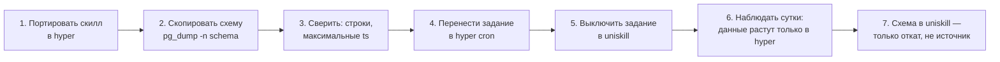

# Переезд с uniskill на hyper: подготовка

Замер сделан 19 августа 2026 на живых базах (`uniskill` — 54392, `hyper` — 54393) и на
работающих процессах обоих рантаймов. Ничего не переносится этим документом; он о том, что
уже уехало, что осталось, и в каком порядке двигать остальное, чтобы не потерять данные.

## Где мы сейчас

Переезжают **три разные вещи**, и путать их нельзя: код (скиллы), данные (схемы в базе) и
живое поведение (регулярные синхронизации, секреты, точки входа). Сегодня они разъехались:
часть кода уже в hyper, данные частично скопированы, а **все синхронизации по-прежнему
крутятся в uniskill**.

### Данные: что уже в hyper

| домен | uniskill | hyper | статус |
|---|---:|---:|---|
| `myhealth` | 2 939 850 | 2 939 850 | совпадает построчно, свежесть одинаковая (последняя запись 13:41) |
| `crm` → `crme` | 142 783 | 148 696 | переехало и обросло новыми данными |
| `linkedin` | 15 691 | 15 649 | почти совпадает — **42 строки расхождения, надо объяснить** |
| `news` | 1 588 | 1 589 | совпадает |
| `focus` | 143 | 143 | совпадает |
| `uptodate` | 3 | 3 | совпадает |

### Данные: что осталось только в uniskill

| схема | строк | что это |
|---|---:|---|
| `fhir` | 854 773 | зеркало Zulip (сообщения, темы, участники) — самый большой кусок |
| `sessions` | 312 962 | зеркало сессий Claude + файлы |
| `ehr` | 84 833 | база знаний ONC/HL7: сущности, чанки, упоминания |
| `docset` | 55 578 | чанки документации с эмбеддингами |
| `cron` | 24 702 | история запусков заданий |
| `viking` | 4 832 | узлы и эволюционировавшие сессии |
| `kb` | 2 506 | граф знаний (частично заменён hyper-овским `knowledge`, 2 448) |
| `mail` | 1 254 | зеркало почты |
| `agent` | 411 | сессии старого агента |
| `docs` | 363 | документы и чанки |
| `notify` | 256 | журнал уведомлений |
| `howtos` | 6 | заметки |
| `public.arxiv_*` | ~950 | кэш arXiv |

Не переносим никогда: `tiger`, `topology`, `spatial_ref_sys` (PostGIS-геокодер),
`paradedb`, `pgivm`, `pdb` — это служебные схемы расширений, они создаются сами.

### Опасное место: телеграм переехал наполовину

`telegram` в uniskill — 44 658 строк, в hyper — 239. При этом задание `telegram-sync`
крутится **в uniskill** каждый час и последний раз отработало сегодня в 16:54. То есть
данные продолжают накапливаться в старой базе, а в новой лежит огрызок. Это худшее из
возможных состояний: обе системы живы и обе считают себя правой.

## Живое поведение: 12 заданий, все ещё в uniskill

Работают прямо сейчас (последние запуски — сегодня):

| задание | функция | период | последний запуск |
|---|---|---|---|
| `agent-idle` | `agent.idleStop` | 2м | 17:53 |
| `sessions-sync` | `sessions.sync` | 1ч | 17:50 |
| `mail-sync-gmail` | `mail.sync` | 1ч | 17:48 |
| `docs-sync` | `docs.sync` | 1ч | 17:47 |
| `linkedin-feed` | `linkedin.syncFeed` | 1ч | 17:42 |
| `mail-sync-hs` | `mail.sync` | 1ч | 17:39 |
| `fhir-zulip-sync` | `fhir.refresh` | 1ч | 16:56 |
| `health-sync` | `myhealth.sync` | 1ч | 16:55 |
| `telegram-sync` | `telegram.syncAll` | 1ч | 16:54 |
| `news-fhir-weekly` | `news.fhirDigest` | 7д | 16:42 |
| `news-databases` | `news.hn` | 1д | 12:38 |
| `repl-refresh` | `procs.repl.refresh` | 1д | 11:32 |

**Пока задание живёт в uniskill, домен не переехал** — сколько бы строк ни было
скопировано. Пять из них (`linkedin`, `health`, `telegram`, `news`, плюс `docs`) относятся
к доменам, которые формально уже «в hyper».

## Код: 43 скилла против 25 плагинов

В `~/uniskill/skills` — 43 скилла. В hyper: 16 в `plugins/` и 9 в `~/.hyper/user/`.

**Уже есть в hyper:** arxiv, browser, gcs, gh, google, gplaces, telegram, tts, youtube,
zulip, news, tasks, circleback, ebooks, focus, linkedin, myhealth, ramp, uptodate,
knowledge (вместо `kb`), research (вместо `consensus`), crme (вместо `crm`), duckdb, rss.

**Ещё нет:** agents, config, cron, docs, docset, ehr, fhir, flights, hackmd, hooks,
howtos, llm, mail, md, pipedrive, pubmed, secret, sessions, skills, tailwindui, tunnel,
undermind, writer.

Из них по-настоящему нужны те, за которыми стоят данные и задания: `fhir` (зеркало
Zulip), `sessions`, `mail`, `docs`/`docset`, `ehr`, `cron`. Остальные — либо тонкие
обёртки над внешним API (flights, pubmed, hackmd, undermind, pipedrive, tailwindui), либо
инфраструктура старого рантайма, которая в hyper решена иначе (config, hooks, llm, secret,
skills, agents, tunnel).

## Порядок: домен за доменом, а не «всё сразу»

Единица переезда — **домен целиком**: скилл + его схема + его задание. Половинчатый
переезд (как сейчас с телеграмом) хуже, чем не начатый.

Ключевой момент — **шаг 5 идёт сразу после шага 4**: два живых писателя в один домен
расходятся за часы. И шаг 3 повторяется после шага 6: если за сутки в старой базе
что-то прибавилось, значит писатель остался.

### Предлагаемая очередь

1. **Телеграм — первым**, потому что он уже сломан пополам и чинить дешевле сейчас.
2. **`sessions` и `mail`** — простые зеркала: данные append-only, конфликтов нет.
3. **`fhir` (зеркало Zulip)** — самый большой объём, но данные однородные; переносить
   `pg_dump -n fhir` целиком, а не выборочно.
4. **`docs` + `docset`** — вместе, у них общая логика чанков и эмбеддингов; заодно решить,
   не заменяет ли их hyper-овский `functions`/RAG.
5. **`ehr`** — переносить вместе со своим корпусом в `~/onc-ehr`.
6. **`kb` → `knowledge`** — не копирование, а слияние: в hyper уже 2 448 строк своих.
7. **`viking`, `agent`, `notify`, `howtos`** — решить, нужны ли вообще; это кандидаты на
   «не переносим, оставляем в архиве».
8. **`cron`** — последним: пока не переехало всё остальное, история заданий нужна там.

## Что должно быть готово до первого шага

- **Резервные копии обеих баз.** `pg_dump -Fc` с `uniskill` и `hyper` перед каждым
  доменом. Это тот самый пункт из [schema.md](schema.md), который до сих пор не сделан, а
  без него переезд — операция без страховки.
- **Одинаковые расширения.** В hyper уже есть paradedb/pgivm; перед переносом схем с BM25
  и эмбеддингами проверить, что индексы пересоздаются, а не приезжают битыми.
- **Секреты.** В hyper есть `oauth_credentials` (зашифрованные токены) и `settings`; в
  uniskill — `public.config`. Перед переносом почты и календаря убедиться, что токены
  живут в hyper, иначе первое же задание упадёт на авторизации.
- **Планировщик hyper.** Таблицы `cron_tasks`/`cron_runs` в hyper уже есть — надо
  проверить, что задание с периодом «час» переживает перезапуск процесса (это ровно то,
  что описано в [durable-runs.md](durable-runs.md)).

## Критерии готовности и откат

Домен считается переехавшим, когда: скилл отвечает в hyper, число строк и максимальная
временная метка совпадают, задание работает в hyper и выключено в uniskill, и **сутки
спустя** в старой схеме не появилось ни одной новой строки.

Откат на любом шаге — включить задание обратно в uniskill: старая схема остаётся нетронутой
как источник отката (именно так уже сделано для `myhealth`). Удалять её можно не раньше,
чем через неделю после того, как домен признан переехавшим.

## Вопросы, на которые нужен твой ответ

1. **`viking`, `agent`, `howtos`, `notify`** — переносим или архивируем? За ними 5 500
   строк и, судя по всему, старые эксперименты.
2. **`kb` против `knowledge`** — слить (и по какому правилу разрешать конфликты сущностей)
   или начать в hyper с чистого листа?
3. **Тонкие обёртки** (flights, pubmed, hackmd, undermind, pipedrive, tailwindui) — портим
   по мере надобности или переносим все сразу, чтобы выключить uniskill целиком?
4. **Что считаем концом переезда** — выключение процесса uniskill или только его заданий?
   От этого зависит, надо ли портировать `config`, `secret`, `tunnel` и `skills`.
